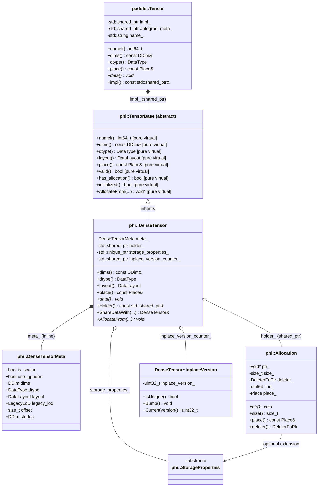

# Paddle 原生 Tensor 架构学习文档

本文档结合具体代码，一步步讲解 Paddle 原生 `paddle::Tensor` / `phi::DenseTensor` 的架构设计与实现原理。

> **Note**: 本文档参考 `D:\Lenovo\Paddle` 仓库源码编写。

---

## 1. 整体架构概览

Paddle 的 Tensor 采用**双层架构**：API 层的 `paddle::Tensor` 作为轻量句柄，通过 `shared_ptr` 指向实现层的 `phi::DenseTensor`。`DenseTensor` 持有元数据（`DenseTensorMeta`）和内存块（`phi::Allocation`）。

### 1.1 核心组件关系图



### 1.2 关键设计原则

| 设计点 | 说明 |
|--------|------|
| **双层解耦** | `paddle::Tensor`（API 层）与 `phi::DenseTensor`（实现层）分离，通过 `impl_` 委托 |
| **shared_ptr 共享** | `impl_` 和 `holder_` 均使用 `shared_ptr`，支持多 Tensor 共享底层数据和实现 |
| **元数据内联** | `DenseTensorMeta` 作为值类型直接嵌入 `DenseTensor`，减少指针跳转 |
| **Offset 视图** | `meta_.offset` 支持共享父 Tensor 的部分数据（如 slice）|
| **惰性 AutogradMeta** | `autograd_meta_` 按需创建，不需要梯度时无额外开销 |

---

## 2. 核心组件详解

### 2.1 paddle::Tensor — API 层句柄

`paddle::Tensor` 是用户直接交互的 API 层类，自身不持有任何数据，所有操作都委托给 `impl_`：

```cpp
// paddle/phi/api/include/tensor.h (lines 91, 115, 705)
class PADDLE_API Tensor final {
 public:
  explicit Tensor(std::shared_ptr<phi::TensorBase> tensor_impl);

  int64_t numel() const;
  const common::DDim& dims() const;
  DataType dtype() const;
  const Place& place() const;

  // 所有数据访问都委托给 impl_
  template <typename T>
  T* data();
  void* data();

  const std::shared_ptr<phi::TensorBase>& impl() const;

 private:
  std::shared_ptr<phi::TensorBase> impl_{nullptr};
  std::shared_ptr<AbstractAutogradMeta> autograd_meta_;
  std::string name_;
};
```

**关键点**：
- `Tensor` 支持默认构造（空状态，impl_ 为 nullptr）
- 拷贝构造共享同一 `impl_`（浅拷贝语义）
- 通过 `impl()` 可向下转型到 `phi::DenseTensor`

### 2.2 phi::DenseTensor — 核心实现

`phi::DenseTensor` 继承自 `phi::TensorBase`，是实际持有数据和元数据的类：

```cpp
// paddle/phi/core/dense_tensor.h (lines 37, 82-150, 253-255)
class PADDLE_API DenseTensor : public TensorBase,
                               public TypeInfoTraits<TensorBase, DenseTensor> {
 public:
  int64_t numel() const override;
  const DDim& dims() const noexcept override { return meta_.dims; }
  DataType dtype() const noexcept override { return meta_.dtype; }
  DataLayout layout() const noexcept override { return meta_.layout; }
  const Place& place() const override;
  bool valid() const noexcept override { return meta_.valid(); }
  bool initialized() const override { return holder_ && holder_->ptr(); }
  bool has_allocation() const override { return holder_ != nullptr; }

  const std::shared_ptr<phi::Allocation>& Holder() const { return holder_; }
  DenseTensor& ShareDataWith(const DenseTensor& src);

  void* AllocateFrom(Allocator* allocator,
                     DataType dtype,
                     size_t requested_size = 0,
                     bool fake_alloc = false) override;

 protected:
  DenseTensorMeta meta_;                              // 元数据（内联）
  std::shared_ptr<phi::Allocation> holder_;           // 内存持有者
  std::unique_ptr<StorageProperties> storage_properties_{nullptr};
  std::shared_ptr<InplaceVersion> inplace_version_counter_;
};
```

**关键点**：
- `meta_` 包含形状（dims）、数据类型（dtype）、布局（layout）、偏移（offset）、步长（strides）等所有描述信息
- `holder_` 使用 `shared_ptr<Allocation>`，支持通过 `ShareDataWith` 零拷贝共享内存
- `inplace_version_counter_` 用于检测 inplace 操作是否会导致梯度计算错误

### 2.3 phi::DenseTensorMeta — 元数据容器

```cpp
// paddle/phi/core/tensor_meta.h (lines 50-87)
struct PADDLE_API DenseTensorMeta {
  bool is_scalar{false};
  bool use_gpudnn{true};
  DDim dims;
  DataType dtype{DataType::UNDEFINED};
  DataLayout layout{DataLayout::NCHW};
  LegacyLoD legacy_lod;
  size_t offset{0};
  DDim strides;
};
```

**关键点**：
- `offset` 以字节为单位（不同于 PyTorch 以元素个数为单位）
- `strides` 在 2.5+ 版本引入，支持非连续张量
- `legacy_lod` 用于序列数据（如 NLP 中的变长序列）

### 2.4 phi::Allocation — 内存块

```cpp
// paddle/phi/core/allocator.h (lines 29-93)
class Allocation {
 public:
  virtual void* ptr() const noexcept { return ptr_; }
  virtual size_t size() const noexcept { return size_; }
  virtual const Place& place() const noexcept { return place_; }

 protected:
  void* ptr_{nullptr};
  size_t size_{};
  DeleterFnPtr deleter_{nullptr};
  uint64_t id_{0};
  Place place_;
};
```

**关键点**：
- `ptr()` 标记为 `virtual`，因为 `VirtualMemoryAutoGrowthBestFitAllocator` 可能在运行中改变 `ptr_`
- `deleter_` 是 `void (*)(Allocation*)` 类型的函数指针，负责释放内存
- `id_` 用于调试和内存追踪

---

## 3. 关键方法实现路径

### 3.1 `Tensor::data()` — 获取数据指针

```cpp
// 第 1 步: API 层委托
// paddle/phi/api/lib/tensor.cc (lines 340-358)
void* Tensor::data() {
  if (is_dense_tensor()) {
    return static_cast<phi::DenseTensor*>(impl_.get())->data();
  }
  // ... 其他 Tensor 类型分支
}

// 第 2 步: DenseTensor 计算指针 + offset
// paddle/phi/core/dense_tensor.cc (lines 178-186)
void* DenseTensor::data() {
  check_memory_size();
  PADDLE_ENFORCE_NOT_NULL(holder_, ...);
  uintptr_t ptr = reinterpret_cast<uintptr_t>(holder_->ptr()) + meta_.offset;
  return reinterpret_cast<void*>(ptr);
}

// 第 3 步: Allocation 返回原始指针
// paddle/phi/core/allocator.h (line 62)
virtual void* ptr() const noexcept { return ptr_; }
```

### 3.2 `Tensor::dims()` / `Tensor::shape()`

```cpp
// paddle/phi/api/lib/tensor.cc (lines 90-95)
const phi::DDim& Tensor::dims() const { return impl_->dims(); }

std::vector<int64_t> Tensor::shape() const {
  const auto& dims = impl_->dims();
  return common::vectorize<int64_t>(dims);
}

// paddle/phi/core/dense_tensor.h (line 86)
const DDim& dims() const noexcept override { return meta_.dims; }
```

### 3.3 `Tensor::place()`

```cpp
// paddle/phi/api/lib/tensor.cc (lines 161-168)
const Place& Tensor::place() const {
  PADDLE_ENFORCE_NOT_NULL(impl_, ...);
  return impl_->place();
}

// paddle/phi/core/dense_tensor.cc
// place() 从 holder_->place() 或缓存的 place 获取
const Place& place() const override;
```

### 3.4 `DenseTensor::AllocateFrom()` — 内存分配

```cpp
// paddle/phi/core/dense_tensor.cc (lines 95-149)
void* DenseTensor::AllocateFrom(Allocator* allocator,
                                DataType dtype,
                                size_t requested_size,
                                bool fake_alloc) {
  // 1. 计算所需字节数
  size_t bytes = numel() * SizeOf(this->dtype());

  // 2. 检查是否需要重新分配
  if (!holder_ || holder_->size() < bytes + meta_.offset) {
    meta_.offset = 0;
    holder_ = allocator->Allocate(bytes);  // 创建新的 Allocation
  }

  // 3. 返回指针（考虑 offset）
  uintptr_t ptr = reinterpret_cast<uintptr_t>(holder_->ptr()) + meta_.offset;
  return reinterpret_cast<void*>(ptr);
}
```

---

## 4. 内存共享机制

### 4.1 `ShareDataWith` — 共享底层内存

```cpp
// paddle/phi/core/dense_tensor.cc
DenseTensor& DenseTensor::ShareDataWith(const DenseTensor& src) {
  // 共享 Allocation（引用计数 +1）
  holder_ = src.holder_;
  // 复制元数据（浅拷贝）
  set_meta(src.meta());
  return *this;
}
```

**效果**：两个 `DenseTensor` 持有同一个 `Allocation`（通过 `shared_ptr` 共享），修改任一张量的数据都会反映到另一张量。

### 4.2 `slice` — 共享子张量

```cpp
// paddle/phi/api/lib/tensor.cc
Tensor Tensor::slice(int64_t begin_idx, int64_t end_idx) const {
  // 1. 创建新的 Tensor（新的 DenseTensor）
  // 2. 共享 holder_（shared_ptr 拷贝）
  // 3. 调整 dims 和 offset
  // 结果：新 Tensor 与原 Tensor 共享底层 Allocation
}
```

---

## 5. 与 PyTorch Tensor 的对比

| 属性 | Paddle Tensor | PyTorch Tensor |
|------|---------------|----------------|
| 句柄类型 | `shared_ptr<phi::TensorBase>` | `intrusive_ptr<TensorImpl>` |
| 实现类 | `phi::DenseTensor`（继承 TensorBase） | `c10::TensorImpl`（继承 intrusive_ptr_target）|
| 存储抽象 | `phi::Allocation`（直接 holder） | `c10::Storage` + `StorageImpl` 间接层 |
| 元数据 | `DenseTensorMeta`（值类型，内联） | `SizesAndStrides` + 分散字段 |
| offset | `meta_.offset`（字节） | `storage_offset_`（元素个数）|
| strides | `meta_.strides` | `sizes_and_strides_`（内联优化）|
| version counter | `InplaceVersion` 在 DenseTensor | `VariableVersion` 在 TensorImpl |
| allocator | DenseTensor 构造时传入 | StorageImpl 持有 |
| 设备信息 | `Allocation.place_` | `StorageImpl.data_ptr_.device` 或 `device_opt_` |
| 引用计数 | `shared_ptr`（标准库） | `intrusive_ptr`（侵入式，C++/Python 共享）|

---

## 6. 参考代码路径

| 文件 | 说明 |
|------|------|
| `paddle/phi/api/include/tensor.h` | `paddle::Tensor` API 定义 |
| `paddle/phi/api/lib/tensor.cc` | `paddle::Tensor` 方法实现 |
| `paddle/phi/core/tensor_base.h` | `phi::TensorBase` 抽象接口 |
| `paddle/phi/core/dense_tensor.h` | `phi::DenseTensor` 定义 |
| `paddle/phi/core/dense_tensor.cc` | `phi::DenseTensor` 实现 |
| `paddle/phi/core/tensor_meta.h` | `DenseTensorMeta` 定义 |
| `paddle/phi/core/allocator.h` | `phi::Allocation` 定义 |
