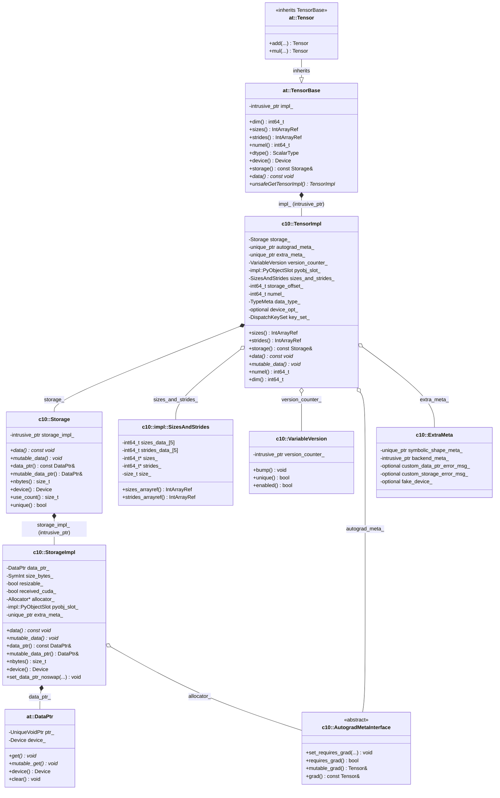

# PyTorch 原生 Tensor 架构学习文档

本文档结合具体代码，一步步讲解 PyTorch 原生 `at::Tensor` / `c10::TensorImpl` / `c10::Storage` 的架构设计与实现原理。

> **Note**: 本文档参考 `D:\Lenovo\pytorch` 仓库源码编写。

---

## 1. 整体架构概览

PyTorch 的 Tensor 采用**三层引用链**：API 层的 `at::TensorBase` 通过 `intrusive_ptr` 管理 `c10::TensorImpl`，`TensorImpl` 持有 `c10::Storage`，`Storage` 再通过 `intrusive_ptr` 管理 `StorageImpl`，最终 `StorageImpl` 的 `DataPtr` 指向实际内存。

### 1.1 核心组件关系图



### 1.2 关键设计原则

| 设计点 | 说明 |
|--------|------|
| **intrusive_ptr** | 侵入式引用计数，C++ 和 Python 共享同一个引用计数器 |
| **Storage 间接层** | `Storage` 句柄 + `StorageImpl` 实现，支持引用语义和视图共享 |
| **SizesAndStrides 内联** | 5 维以内 sizes/strides 直接内联在对象内，减少堆分配 |
| **Lazy ExtraMeta** | `ExtraMeta`、`AutogradMeta` 惰性分配，不需要时不占内存 |
| **Bitfields 紧凑** | 使用位域压缩标志位，TensorImpl 仅约 160 bytes |
| **Version Counter** | 在 TensorImpl 级别跟踪 inplace 操作，检测梯度计算错误 |

---

## 2. 核心组件详解

### 2.1 at::TensorBase — API 层句柄

`at::TensorBase` 是用户可见的轻量句柄，所有操作委托给 `impl_`：

```cpp
// aten/src/ATen/core/TensorBase.h (lines 93, 109-113, 128-371)
class TORCH_API TensorBase {
 public:
  explicit TensorBase(
      c10::intrusive_ptr<TensorImpl, UndefinedTensorImpl> tensor_impl)
      : impl_(std::move(tensor_impl)) {
    TORCH_CHECK(impl_.get(), "TensorImpl with nullptr is not supported");
  }

  int64_t dim() const { return impl_->dim(); }
  IntArrayRef sizes() const { return impl_->sizes(); }
  IntArrayRef strides() const { return impl_->strides(); }
  int64_t numel() const { return impl_->numel(); }
  ScalarType scalar_type() const { return typeMetaToScalarType(impl_->dtype()); }
  const Storage& storage() const { return impl_->storage(); }

  bool has_storage() const {
    return defined() && impl_->has_storage();
  }

  TensorImpl* unsafeGetTensorImpl() const { return impl_.get(); }

 protected:
  c10::intrusive_ptr<TensorImpl, UndefinedTensorImpl> impl_;
};
```

**关键点**：
- `Tensor` 继承自 `TensorBase`，仅添加自动生成的算子方法（`at::add`, `at::mul` 等）
- `UndefinedTensorImpl` 作为 `intrusive_ptr` 的第二个模板参数，处理 null tensor 情况
- `use_count()` / `weak_use_count()` 直接暴露 `intrusive_ptr` 的引用计数

### 2.2 c10::TensorImpl — 张量实现核心

```cpp
// c10/core/TensorImpl.h (lines 510, 1057-1061, 2874-2961)
struct C10_API TensorImpl : public c10::intrusive_ptr_target {
 protected:
  Storage storage_;                              // 存储句柄
  std::unique_ptr<c10::AutogradMetaInterface> autograd_meta_ = nullptr;
  std::unique_ptr<c10::ExtraMeta> extra_meta_ = nullptr;
  c10::VariableVersion version_counter_;
  impl::PyObjectSlot pyobj_slot_;
  c10::impl::SizesAndStrides sizes_and_strides_;
  int64_t storage_offset_ = 0;
  int64_t numel_ = 1;
  caffe2::TypeMeta data_type_;
  std::optional<c10::Device> device_opt_;
  DispatchKeySet key_set_;

  // bitfields
  bool is_contiguous_ : 1;
  bool storage_access_should_throw_ : 1;
  bool is_channels_last_ : 1;
  bool is_channels_last_contiguous_ : 1;
  bool has_symbolic_sizes_strides_ : 1;
  // ... more flags
};
```

**关键点**：
- `storage_` 是核心数据持有者，通过 `storage_offset_` 支持子张量视图
- `sizes_and_strides_` 使用小数组优化（5 维内内联存储）
- `numel_` 缓存元素总数，避免每次重新计算
- `device_opt_` 缓存设备信息（与 storage 非空时保持一致）
- `data_type_` 缓存元素类型（与 storage 非空时保持一致）
- `version_counter_` 用于检测 inplace 操作对梯度计算的影响

### 2.3 c10::Storage / c10::StorageImpl — 存储管理

```cpp
// c10/core/Storage.h (lines 25-200)
struct C10_API Storage {
 protected:
  c10::intrusive_ptr<StorageImpl> storage_impl_;

 public:
  const void* data() const { return storage_impl_->data(); }
  void* mutable_data() const { return storage_impl_->mutable_data(); }
  const at::DataPtr& data_ptr() const { return storage_impl_->data_ptr(); }
  at::DataPtr& mutable_data_ptr() const { return storage_impl_->mutable_data_ptr(); }
  size_t nbytes() const { return storage_impl_->nbytes(); }
  Device device() const { return storage_impl_->device(); }
  size_t use_count() const { return storage_impl_.use_count(); }
};

// c10/core/StorageImpl.h (lines 55-399)
struct C10_API StorageImpl : public c10::intrusive_ptr_target {
 private:
  DataPtr data_ptr_;                    // 数据指针
  SymInt size_bytes_;                   // 存储字节数
  bool resizable_;
  bool received_cuda_;
  bool has_mutable_data_ptr_check_ = false;
  bool throw_on_mutable_data_ptr_ = false;
  bool throw_on_immutable_data_ptr_ = false;
  MaterializeFn materialize_fn_ = nullptr;
  Allocator* allocator_;
  impl::PyObjectSlot pyobj_slot_;
  std::unique_ptr<StorageExtraMeta> extra_meta_ = nullptr;

 public:
  const void* data() const { return data_ptr_.get(); }
  void* mutable_data() { return data_ptr_.mutable_get(); }
  at::DataPtr& mutable_data_ptr() { return data_ptr_; }
  Device device() const { return data_ptr_.device(); }
};
```

**关键点**：
- `Storage` 拷贝构造共享 `StorageImpl`（引用语义）
- `StorageImpl` 使用 `intrusive_ptr` 实现引用计数
- `materialize_fn_` 支持 Copy-on-Write 惰性物化
- `extra_meta_` 支持自定义 data_ptr 访问错误消息

### 2.4 at::DataPtr — 数据指针封装

```cpp
// c10/core/Allocator.h
class C10_API DataPtr {
 private:
  c10::detail::UniqueVoidPtr ptr_;   // owning 智能指针
  Device device_;                     // 关联设备

 public:
  void* get() const { return ptr_.get(); }
  void* mutable_get() { return ptr_.get(); }
  Device device() const { return device_; }
  void clear() { ptr_.clear(); }
};
```

底层 `UniqueVoidPtr` (`c10/util/UniqueVoidPtr.h`)：

```cpp
class UniqueVoidPtr {
 private:
  void* data_;                              // 数据指针（非 owning）
  std::unique_ptr<void, DeleterFnPtr> ctx_; // 上下文 + deleter（owning）
};
```

**关键点**：
- `DataPtr` 将原始指针、deleter、设备信息封装在一起
- `UniqueVoidPtr` 使用 `unique_ptr<void, DeleterFnPtr>` 管理释放
- `device_` 与 `Allocator` 的设备信息保持一致

---

## 3. 关键方法实现路径

### 3.1 `TensorBase::data()` — 获取数据指针

```cpp
// 第 1 步: TensorBase 委托给 TensorImpl
// aten/src/ATen/core/TensorBase.h (lines 1695-1699)
inline void* mutable_data() {
  return data_impl<void>(
      [this] { return static_cast<char*>(storage_.mutable_data()); });
}

// 第 2 步: TensorImpl 添加 storage_offset
// c10/core/TensorImpl.h (lines 1660-1667)
void* mutable_data() {
  return get_data() + storage_offset_ * itemsize();
}

// 第 3 步: Storage -> StorageImpl -> DataPtr
// c10/core/StorageImpl.h (lines 210-224)
void* mutable_data() {
  return data_ptr_.mutable_get();
}
```

### 3.2 `TensorBase::sizes()` / `strides()`

```cpp
// aten/src/ATen/core/TensorBase.h (lines 252-262)
IntArrayRef sizes() const { return impl_->sizes(); }
IntArrayRef strides() const { return impl_->strides(); }

// c10/core/TensorImpl.h
// sizes() / strides() 从 sizes_and_strides_ 获取
IntArrayRef sizes() const { return sizes_and_strides_.sizes_arrayref(); }
IntArrayRef strides() const { return sizes_and_strides_.strides_arrayref(); }
```

### 3.3 `TensorBase::device()`

```cpp
// c10/core/TensorImpl.h
// device() 从 device_opt_ 或 storage 推断
Device device() const {
  if (C10_UNLIKELY(device_policy_)) {
    return device_custom();
  }
  TORCH_CHECK(device_opt_.has_value(), ...);
  return *device_opt_;
}
```

### 3.4 `TensorBase::storage()`

```cpp
// aten/src/ATen/core/TensorBase.h (lines 369-371)
const Storage& storage() const {
  return impl_->storage();
}

// c10/core/TensorImpl.h (lines 1073-1078)
TENSORIMPL_MAYBE_VIRTUAL const Storage& storage() const {
  if (C10_UNLIKELY(storage_access_should_throw_)) {
    throw_storage_access_error();
  }
  return storage_;
}
```

---

## 4. 内存共享机制

### 4.1 Storage 引用语义

```cpp
// c10/core/Storage.h (lines 32-34)
Storage(c10::intrusive_ptr<StorageImpl> ptr)
    : storage_impl_(std::move(ptr)) {}

// Storage 拷贝构造共享 StorageImpl
// intrusive_ptr 拷贝 => 引用计数 +1
```

### 4.2 Tensor 视图（View）

```cpp
// 例如：tensor.view({...})
// 1. 创建新的 TensorImpl（新的 SizesAndStrides）
// 2. 共享同一个 storage_（intrusive_ptr 拷贝）
// 3. 设置不同的 storage_offset_ 和 sizes/strides
// 结果：多个 TensorImpl 指向同一个 StorageImpl
```

### 4.3 `is_alias_of` 检测

```cpp
// aten/src/ATen/core/TensorBase.h (lines 372-374)
bool is_alias_of(const at::TensorBase& other) const {
  return impl_->storage().is_alias_of(other.storage());
}

// c10/core/Storage.h (lines 195-199)
bool is_alias_of(const Storage& other) const {
  return (
      storage_impl_ == other.storage_impl_ ||
      isSharedStorageAlias(*this, other));
}
```

---

## 5. 与 Paddle Tensor 的对比

| 属性 | PyTorch Tensor | Paddle Tensor |
|------|----------------|---------------|
| Tensor 句柄 | `intrusive_ptr<TensorImpl>` | `shared_ptr<TensorBase>` |
| 实现类 | `c10::TensorImpl`（继承 intrusive_ptr_target） | `phi::DenseTensor`（继承 TensorBase） |
| 存储抽象 | `c10::Storage` + `StorageImpl` 间接层 | `phi::Allocation` 直接作为 holder |
| 元数据存储 | `SizesAndStrides`（内联 5 维） + 分散字段 | `DenseTensorMeta`（值类型，内联） |
| offset | `storage_offset_`（元素个数） | `meta_.offset`（字节） |
| strides | `sizes_and_strides_`（小数组优化） | `meta_.strides` |
| version counter | `VariableVersion` 在 TensorImpl | `InplaceVersion` 在 DenseTensor |
| allocator | `StorageImpl` 持有 | `DenseTensor` 构造时传入 |
| 设备信息 | `StorageImpl.data_ptr_.device` 或 `device_opt_` | `Allocation.place_` |
| 引用计数 | `intrusive_ptr`（侵入式，跨语言共享） | `shared_ptr`（标准库） |
| TensorImpl 大小 | ~160 bytes | ~880 bytes（含 dnnl::memory::desc） |

---

## 6. 参考代码路径

| 文件 | 说明 |
|------|------|
| `aten/src/ATen/core/TensorBase.h` | `at::TensorBase` 定义 |
| `aten/src/ATen/core/Tensor.h` | `at::Tensor` 定义（自动生成方法） |
| `aten/src/ATen/core/Tensor.cpp` | `at::Tensor` 方法实现 |
| `c10/core/TensorImpl.h` | `c10::TensorImpl` 定义 |
| `c10/core/Storage.h` | `c10::Storage` 定义 |
| `c10/core/StorageImpl.h` | `c10::StorageImpl` 定义 |
| `c10/core/Allocator.h` | `at::DataPtr` 定义 |
| `c10/util/UniqueVoidPtr.h` | `c10::detail::UniqueVoidPtr` 定义 |
| `c10/util/intrusive_ptr.h` | `c10::intrusive_ptr` 定义 |
| `c10/core/impl/SizesAndStrides.h` | `c10::impl::SizesAndStrides` 定义 |
