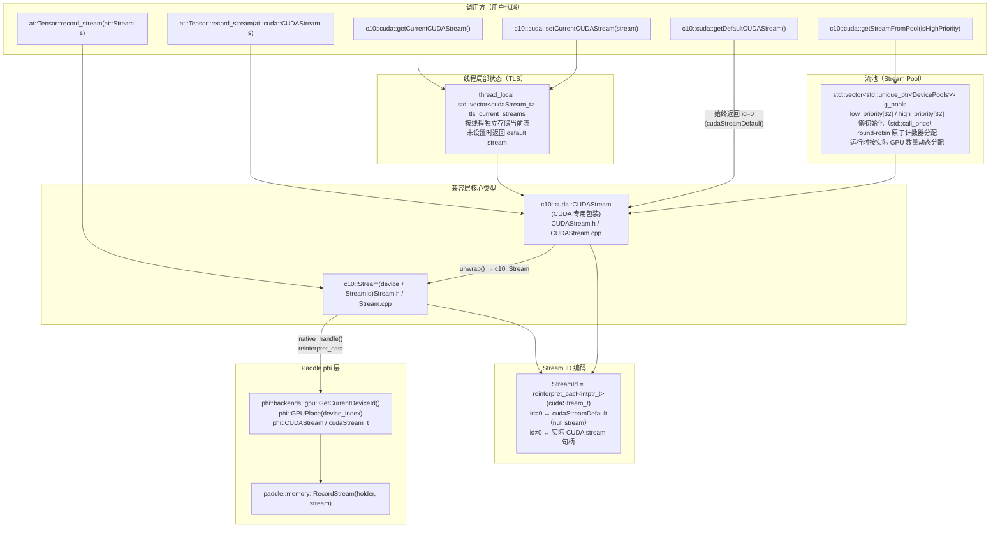

# Paddle C++ 兼容层架构图

本文档描述 Paddle 对 PyTorch C++ API（`c10::Stream`、`c10::cuda::CUDAStream`、`at::Tensor::record_stream`）的兼容层架构，包括各层的映射关系、Paddle 特有实现，以及与 PyTorch 的语义差异。

---

## 整体架构图



---

## 关键语义说明

### `getCurrentCUDAStream()` vs `getDefaultCUDAStream()`

| 函数 | 语义 | 返回值 |
|------|------|--------|
| `getCurrentCUDAStream(dev)` | per-thread per-device 当前流 | TLS 中的流，若未设置则回退到 default stream |
| `getDefaultCUDAStream(dev)` | 设备固定默认流 | 始终为 null stream（id=0，`cudaStreamDefault`） |

这与 PyTorch 语义完全一致：`getCurrentCUDAStream()` 可变（通过 `setCurrentCUDAStream()` 修改），`getDefaultCUDAStream()` 固定不变。

### Stream ID 编码方式

Paddle 兼容层将 `cudaStream_t`（一个指针）直接通过 `reinterpret_cast<intptr_t>` 存储在 `StreamId`（`int64_t`）中：

```
StreamId id = static_cast<StreamId>(reinterpret_cast<intptr_t>(cudaStream_t));
cudaStream_t handle = reinterpret_cast<cudaStream_t>(static_cast<intptr_t>(id));
```

因此：
- `id == 0` ↔ `cudaStreamDefault`（null stream）
- `id != 0` ↔ 实际分配的 CUDA stream 句柄

---

## Paddle 特有实现及必要性说明

以下实现在 PyTorch 中不存在，是 Paddle 特有的适配方案：

### 1. 通过 `phi` 层获取设备和流

**PyTorch 做法**：有独立的 CUDA 设备跟踪机制（`c10::cuda::current_device()` 内部维护自己的状态）。

**Paddle 做法**：通过 `phi::backends::gpu::GetCurrentDeviceId()` 和 `phi::GPUPlace` 获取当前设备。

**必要性**：Paddle 的设备管理由 `phi` 层统一负责，兼容层必须调用 `phi` 层接口才能与 Paddle 的执行引擎协同。直接访问底层 CUDA API 会绕过 Paddle 的流生命周期管理。

### 2. 流池动态分配

**PyTorch 做法**：内部使用编译时固定大小的 `std::array`（`C10_COMPILE_TIME_MAX_GPUS`）。

**Paddle 做法**：使用 `std::vector<std::unique_ptr<DevicePools>>`，在运行时按实际 GPU 数量动态分配。

**必要性**：Paddle 没有 `C10_COMPILE_TIME_MAX_GPUS` 宏，且无需预先分配固定大小的全局数组。动态分配更轻量，也避免了编译时对最大设备数的硬编码限制。

### 3. 流池按设备懒初始化

**PyTorch 做法**：全局 `initCUDAStreamsOnce()` 一次性初始化，之后通过固定数组访问。

**Paddle 做法**：每个设备的流池通过 `std::call_once` 在首次使用时独立初始化。

**必要性**：Paddle 的多设备初始化是按需触发的，兼容层必须与此模型对齐，不能假设所有设备在程序启动时均已初始化。

---

## 向后兼容接口（待移除）

以下接口为过渡期兼容性保留，标有 `TODO` 注释，待下游完成迁移后移除：

| 接口 | 位置 | 原因 |
|------|------|------|
| `Tensor::record_stream(cudaStream_t)` | `ATen/ops/record_stream.h` | DeepEP 旧接口，等价于接受 `at::Stream` 版本 |
| `Event::raw_event()` | `c10/core/Event.h` | 同上 |
