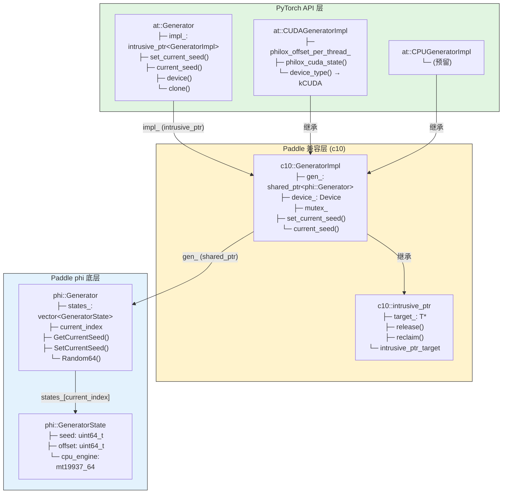
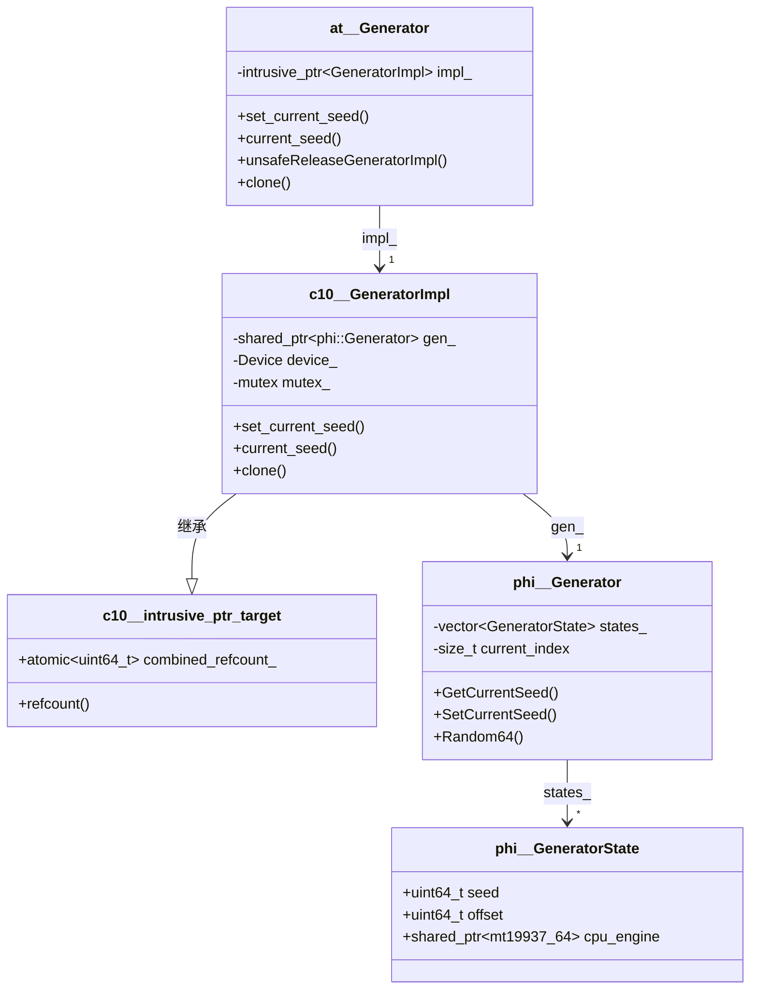
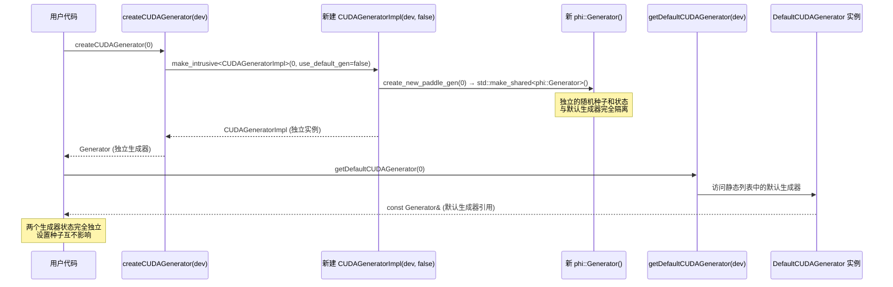
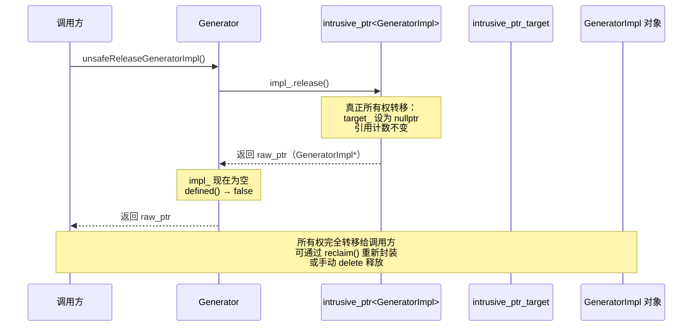
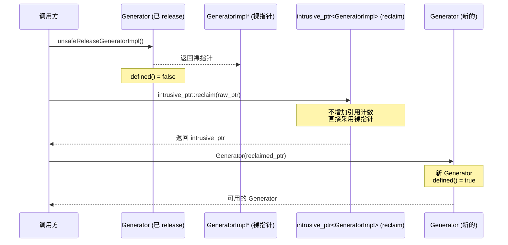

##### Generator.h 头文件 API 兼容性

✅ 表示已经支持
🚧 表示正在支持
❌ 表示不准备支持
🔧 表示部分支持（有功能限制）

**按照功能分类排序**

---

### 构造与赋值

| torch API | paddle API 兼容性 | 测试用例状态 | 优先级 | 备注 |
|-----------|------------------|--------------|--------|------|
| `Generator()` | ✅ | ✅ | P0 | 默认构造 |
| `Generator(intrusive_ptr<GeneratorImpl>)` | ✅ | 🔧 | P0 | 构造逻辑一致；无直接单测 |

---

### 比较与状态判断

| torch API | paddle API 兼容性 | 测试用例状态 | 优先级 | 备注 |
|-----------|------------------|--------------|--------|------|
| `operator==` | ✅ | ✅ | P1 | 比较底层 `impl_` 指针 |
| `operator!=` | ✅ | ✅ | P1 | 基于 `operator==` |
| `defined()` | ✅ | ✅ | P0 | 判定是否持有有效实现 |

---

### 底层实现访问

| torch API | paddle API 兼容性 | 测试用例状态 | 优先级 | 备注 |
|-----------|------------------|--------------|--------|------|
| `unsafeGetGeneratorImpl()` | ✅ | 🔧 | P1 | 接口一致；无直接单测 |
| `unsafeReleaseGeneratorImpl()` | ✅ | ✅ | P2 | 真正实现所有权转移：`defined()` 变为 false；测试验证通过 |
| `getIntrusivePtr()` | ✅ | 🔧 | P2 | 接口一致；无直接单测 |
| `get<T>()` | ✅ | ✅ | P1 | 用于获取 `CUDAGeneratorImpl` |
| `clone()` | ✅ | ✅ | P1 | 状态克隆已测试 |

---

### 随机种子与偏移

| torch API | paddle API 兼容性 | 测试用例状态 | 优先级 | 备注 |
|-----------|------------------|--------------|--------|------|
| `set_current_seed(uint64_t)` | ✅ | ✅ | P0 | 接口一致 |
| `current_seed()` | ✅ | ✅ | P0 | 接口一致 |
| `seed()` | ✅ | 🔧 | P1 | 接口一致；无直接单测 |
| `set_offset(uint64_t)` | ✅ | ✅ | P1 | Philox 场景有效 |
| `get_offset()` | ✅ | ✅ | P1 | Philox 场景有效 |

---

### 状态序列化与图安全状态

| torch API | paddle API 兼容性 | 测试用例状态 | 优先级 | 备注 |
|-----------|------------------|--------------|--------|------|
| `set_state(const at::Tensor&)` | ❌ | - [ ] | P1 | Paddle 兼容层未提供 Tensor 序列化状态写入 |
| `get_state() const -> at::Tensor` | ❌ | - [ ] | P1 | Paddle 兼容层未提供 Tensor 序列化状态读取 |
| `graphsafe_set_state(const Generator&)` | 🔧 | - [ ] | P1 | 接口存在，但语义与 PyTorch 不同：按 Generator 间状态复制实现 |
| `graphsafe_get_state() const` | ✅ | - [ ] | P1 | 通过 `clone()` 返回状态快照 |

---

### 线程与设备信息

| torch API | paddle API 兼容性 | 测试用例状态 | 优先级 | 备注 |
|-----------|------------------|--------------|--------|------|
| `mutex()` | ✅ | 🔧 | P1 | 接口一致；无直接单测 |
| `key_set()` | ✅ | 🔧 | P2 | 接口一致；无直接单测 |
| `device()` | ✅ | ✅ | P0 | 已验证返回 `cuda:0` |

---

### Python 绑定对象

| torch API | paddle API 兼容性 | 测试用例状态 | 优先级 | 备注 |
|-----------|------------------|--------------|--------|------|
| `set_pyobj(PyObject*)` | ✅ | - [ ] | P3 | 接口一致；无单测 |
| `pyobj()` | ✅ | - [ ] | P3 | 接口一致；无单测 |

---

### 模板工具函数

| torch API | paddle API 兼容性 | 测试用例状态 | 优先级 | 备注 |
|-----------|------------------|--------------|--------|------|
| `make_generator<Impl>(...)` | ✅ | 🔧 | P1 | 接口一致；无直接单测 |
| `check_generator<T>(optional<Generator>)` | 🔧 | ✅ | P1 | Paddle 版缺少 `device_type` 一致性检查 |
| `get_generator_or_default<T>(...)` | ✅ | ✅ | P0 | 有效/空 `optional` 两分支均已测试 |

---

### 内部辅助函数（detail 命名空间）

| torch API | paddle API 兼容性 | 测试用例状态 | 优先级 | 备注 |
|-----------|------------------|--------------|--------|------|
| `detail::check_rng_state(const TensorImpl&)` | ❌ | - [ ] | P3 | Paddle 头文件未提供该辅助检查 |

---

### Paddle 兼容层特有 API

| API | 说明 |
|-----|------|
| `paddle_generator()` | 暴露底层 `std::shared_ptr<phi::Generator>`，便于与 phi 侧直接交互 |

---

### 兼容性统计

| 状态 | 数量 |
|------|------|
| ✅ 已完全支持 | 23 |
| 🚧 正在支持 | 0 |
| 🔧 部分支持 | 2 |
| ❌ 未支持 | 3 |

---

### 备注

1. **对比文件**：
   - Paddle: `/home/may/Paddle/paddle/phi/api/include/compat/ATen/core/Generator.h`
   - PyTorch: `/home/may/pytorch/aten/src/ATen/core/Generator.h`

2. **核心差异**：
   - PyTorch 提供 `set_state/get_state`（`Tensor` 序列化状态接口），Paddle 兼容层当前未提供。
   - Paddle 的 `graphsafe_set_state` 采用 Generator 到 Generator 的状态复制语义。
   - Paddle 的 `check_generator<T>` 未做 `T::device_type()` 与 `gen->device().type()` 的一致性校验。

3. **测试依据**：
   - 参考 `test/GeneratorTest.cpp` 中已覆盖用例：`defined`、seed/offset、`device`、`clone`、`get_generator_or_default` 等。
   - 标记为 🔧 或 `- [ ]` 的项多数为头文件接口存在但缺少直接单测。

4. **更新记录**：
   - 2026-03-19 (Round 1): 修复 PR #78070 review comments
     - `createCUDAGenerator()` 现在创建独立的 `phi::Generator` 实例，与默认生成器状态完全隔离
     - `unsafeReleaseGeneratorImpl()` 基于 shared_ptr 后端实现，保留 shared_ptr 引用防止 use-after-free
   - 2026-03-19 (Round 2): 实现真正的侵入式指针
     - 完全重写 `intrusive_ptr.h` 为真正侵入式引用计数实现
     - `unsafeReleaseGeneratorImpl()` 真正实现所有权转移：调用后 `defined()` 变为 false
     - `GeneratorImpl` 继承自 `intrusive_ptr_target`
     - 新增回归测试：`UnsafeReleaseMakesGeneratorUndefined`、`UnsafeReleaseAndReclaim`、`UnsafeReleaseAndReclaimRoundTrip`

---

### Generator 架构层次结构图

> 展示 PyTorch API 兼容层与 Paddle 底层实现的层次关系

#### 架构说明

| 层次 | 主要类 | 职责 |
|------|--------|------|
| **PyTorch API 层** | `at::Generator`, `CUDAGeneratorImpl` | 提供 PyTorch 兼容的公共 API，支持多态和设备特定功能 |
| **兼容层 (c10)** | `GeneratorImpl`, `intrusive_ptr` | 管理对象生命周期（侵入式引用计数），桥接 API 与底层实现 |
| **Paddle phi 层** | `phi::Generator`, `GeneratorState` | 实际的随机数生成实现（Mersenne Twister），状态管理 |

#### 对象关系

---

### createCUDAGenerator 状态独立性时序图

> 说明 `createCUDAGenerator()` 与 `getDefaultCUDAGenerator()` 的状态隔离关系。

### unsafeReleaseGeneratorImpl 所有权语义时序图

> 说明 `unsafeReleaseGeneratorImpl()` 的真正所有权转移行为，与 PyTorch 原生语义一致。

#### 当前实现（真正的侵入式引用计数）

#### 调用方 reclaim 场景

#### 行为对比（Paddle 兼容层 vs PyTorch 原生）

| 行为 | 当前实现 (Round 2) | PyTorch 原生 |
|------|-------------------|--------------|
| 所有权转移 | 完全转移（impl_ 清零，`defined()` → false） | 完全转移（impl_ 清零） |
| 对象生命周期 | 引用计数不减少，由调用方负责 | 引用计数不减少，由调用方负责 |
| 重新封装 | 支持 `intrusive_ptr::reclaim(raw_ptr)` | 支持 `intrusive_ptr::reclaim(raw_ptr)` |
| API 状态 | 正常使用 | 正常使用 |

#### 回归测试验证

- `CUDAGeneratorTest.UnsafeReleaseMakesGeneratorUndefined`：验证调用后 `defined()` 变为 false
- `CUDAGeneratorTest.UnsafeReleaseAndReclaim`：验证 reclaim 可以正常工作，无双重释放
- `CUDAGeneratorTest.UnsafeReleaseAndReclaimRoundTrip`：验证完整工作流（create → release → reclaim → create Generator）
