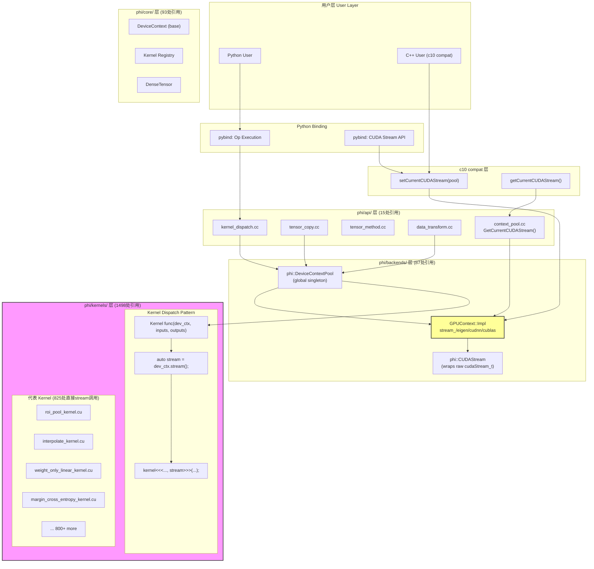
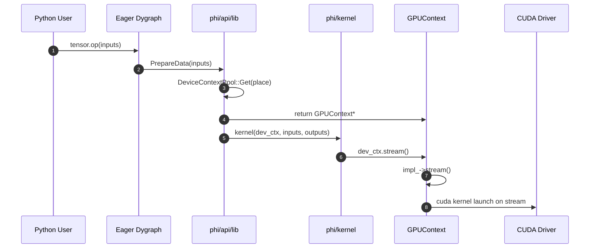
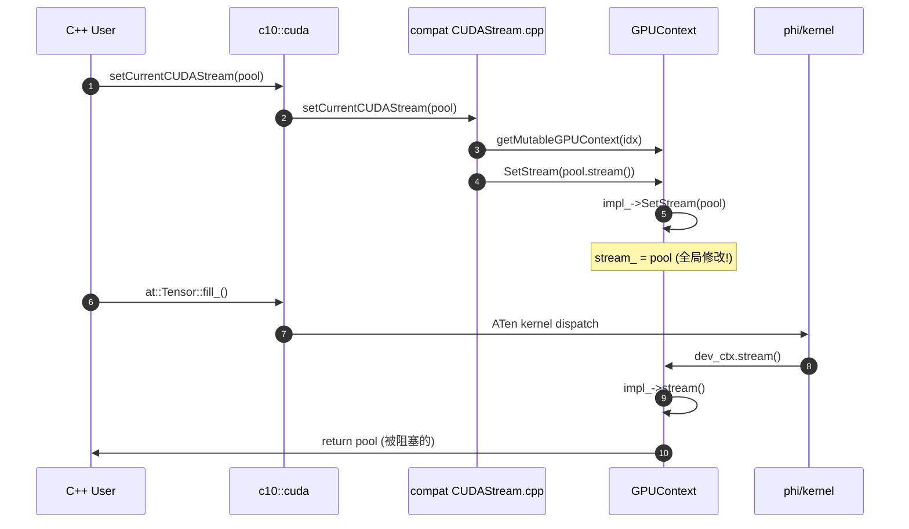
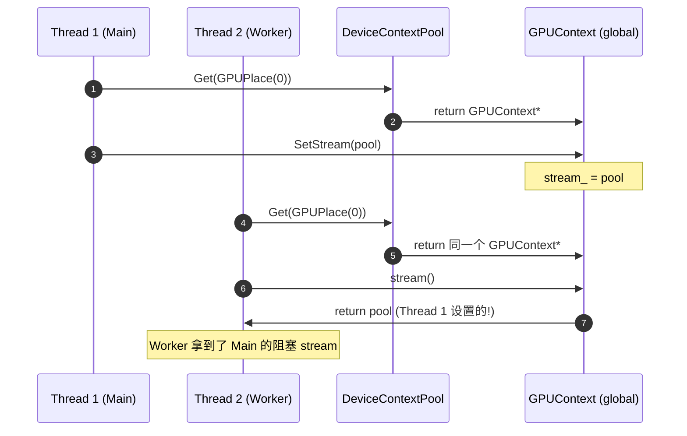
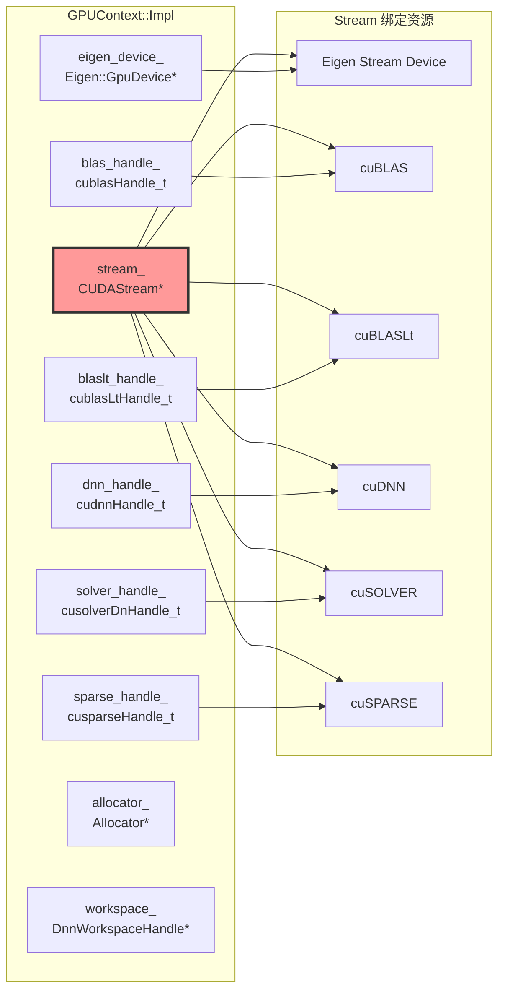
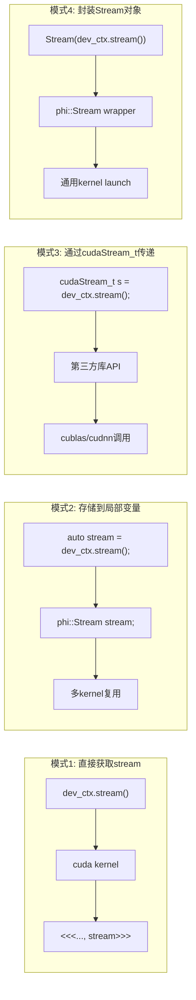
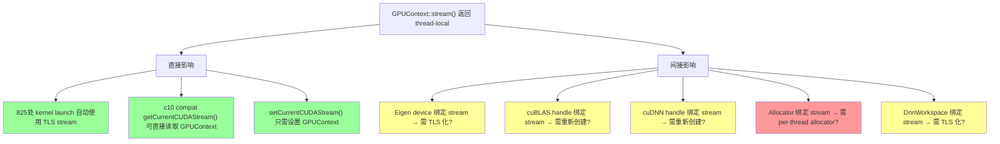
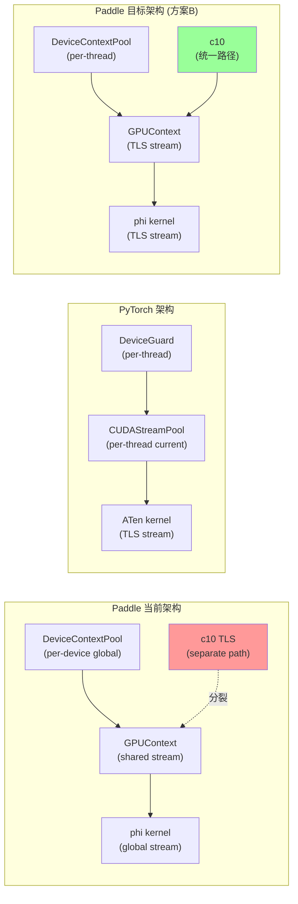

# GPUContext 依赖全景分析

## 统计数据

| 维度 | 数量 |
|---|---|
| GPUContext 总引用 | 1699 处 |
| kernels/ 目录引用 | 1498 处 (88%) |
| core/ 目录引用 | 93 处 (5%) |
| backends/ 目录引用 | 87 处 (5%) |
| api/ 目录引用 | 15 处 (1%) |
| 直接 `dev_ctx.stream()` 调用 | 825 处 |

---

## 架构图：GPUContext 依赖全景

---

## 关键依赖路径分析

### 路径 1：Python → phi kernel → GPUContext stream（主流路径）

### 路径 2：c10 compat → GPUContext stream（C++ API 路径）

### 路径 3：DeviceContextPool 获取（全局单例问题）

---

## GPUContext 内部资源依赖

**关键发现**：`stream_` 是核心资源，所有其他 handle（Eigen、cuBLAS、cuDNN 等）都绑定到这个 stream。如果 `stream_` 变成 thread-local，这些 handle 也需要考虑 thread-local 化。

---

## Kernel 使用 GPUContext stream 的典型模式

**统计**：
- 模式1（直接获取）：~400 处
- 模式2（局部变量）：~300 处
- 模式3（cudaStream_t）：~100 处
- 模式4（Stream封装）：~25 处

---

## 修改影响面评估

### 如果 GPUContext stream 改为 thread-local

**风险等级**：
- 🟢 **低风险**：kernel launch 自动受益（825处）
- 🟡 **中风险**：handle 绑定问题（需验证）
- 🔴 **高风险**：allocator 绑定（可能需要 per-thread allocator）

---

## 与 PyTorch 对比

