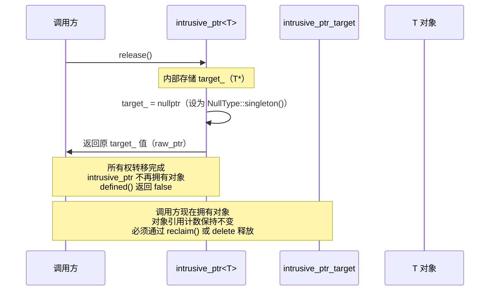
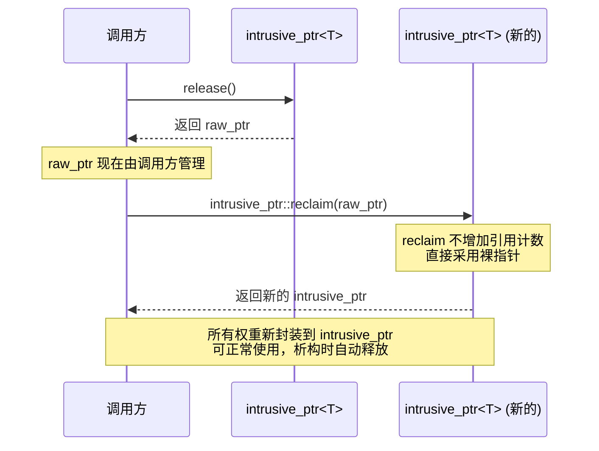

##### intrusive_ptr.h 头文件 API 兼容性

✅ 表示已经支持
🚧 表示正在支持
❌ 表示不准备支持
🔧 表示部分支持（有功能限制）

**按照功能分类排序**

---

### 核心类型

| torch API | paddle API 兼容性 | 测试用例状态 | 优先级 | 备注 |
|-----------|------------------|--------------|--------|------|
| `intrusive_ptr_target` | ✅ | - [x] | P0 | 已实现：原子合并引用计数（refcount+weakcount 存于同一 uint64_t 原子变量） |
| `intrusive_ptr<T, NullType>` | ✅ | - [x] | P0 | 已实现真正侵入式引用计数，不再基于 `std::shared_ptr` |
| `weak_intrusive_ptr<T, NullType>` | ✅ | - [x] | P1 | 已实现弱引用；`lock()` 原子性提升强引用 |
| `weak_intrusive_ptr_target` | ❌ | - [ ] | P2 | 未提供别名类型 |

---

### intrusive_ptr 构造与赋值

| torch API | paddle API 兼容性 | 测试用例状态 | 优先级 | 备注 |
|-----------|------------------|--------------|--------|------|
| `intrusive_ptr()` | ✅ | - [ ] | P0 | 支持 |
| `intrusive_ptr(nullptr_t)` | 🔧 | - [ ] | P1 | Paddle 未显式提供该重载，但默认构造可替代 |
| `intrusive_ptr(T*)` | ✅ | - [ ] | P0 | 支持 |
| `intrusive_ptr(std::shared_ptr<T>)` | 🔧 | - [ ] | P1 | Paddle 特有；PyTorch 原生接口无该构造 |
| 跨类型拷贝构造（`intrusive_ptr<U> -> intrusive_ptr<T>`） | ✅ | - [ ] | P1 | 支持可转换类型 |
| 移动构造 / 移动赋值 | 🔧 | - [ ] | P1 | Paddle 依赖编译器生成；无显式 NullType 变体 |
| 拷贝赋值 | ✅ | - [ ] | P1 | 支持 |

---

### intrusive_ptr 观察器与基础操作

| torch API | paddle API 兼容性 | 测试用例状态 | 优先级 | 备注 |
|-----------|------------------|--------------|--------|------|
| `get()` | ✅ | - [ ] | P0 | 支持 |
| `operator*()` / `operator->()` | ✅ | - [ ] | P0 | 支持 |
| `operator bool()` | ✅ | - [ ] | P1 | 支持（Paddle 为 `explicit`） |
| `defined()` | ✅ | - [ ] | P0 | 支持 |
| `use_count()` | 🔧 | - [ ] | P1 | Paddle 返回 `int64_t`；PyTorch 返回 `uint32_t` |
| `weak_use_count()` | ❌ | - [ ] | P1 | 未支持 |
| `unique()` | ❌ | - [ ] | P1 | 未支持 |
| `is_uniquely_owned()` | ❌ | - [ ] | P1 | 未支持 |
| `reset()` | ✅ | - [ ] | P0 | 支持 |
| `swap(intrusive_ptr&)` | ❌ | - [ ] | P2 | 未提供成员函数 |

---

### 所有权转移与不安全适配

| torch API | paddle API 兼容性 | 测试用例状态 | 优先级 | 备注 |
|-----------|------------------|--------------|--------|------|
| `release()` | ✅ | - [x] | P0 | 真正所有权转移：返回裸指针并将内部 `target_` 设为 null，`defined()` → false |
| `reclaim(T*)` | ✅ | - [x] | P0 | 静态方法，采用原始指针而不增加引用计数 |
| `reclaim_copy(T*)` | ❌ | - [ ] | P1 | 未支持 |
| `unsafe_steal_from_new(T*)` | ❌ | - [ ] | P2 | 未支持 |
| `unsafe_adapt_non_heap_allocated(T*, uint32_t)` | ❌ | - [ ] | P2 | 未支持 |
| `unsafe_reclaim_from_nonowning(T*)` | ❌ | - [ ] | P2 | 未支持 |

---

### 工厂函数与辅助接口

| torch API | paddle API 兼容性 | 测试用例状态 | 优先级 | 备注 |
|-----------|------------------|--------------|--------|------|
| `intrusive_ptr::make(args...)` | ✅ | - [ ] | P1 | 支持 |
| `make_intrusive<T>(args...)` | ✅ | - [x] | P0 | 支持；初始 strong refcount=1, weak refcount=1（与 PyTorch kUniqueRef 对齐） |
| `get_shared()` | 🔧 | - [ ] | P2 | Paddle 特有（用于 shared_ptr 互操作） |

---

### 全局运算符与容器支持

| torch API | paddle API 兼容性 | 测试用例状态 | 优先级 | 备注 |
|-----------|------------------|--------------|--------|------|
| `operator==/!= (intrusive_ptr, intrusive_ptr)` | ✅ | - [ ] | P1 | 支持 |
| `operator==/!= (intrusive_ptr, nullptr)` | ❌ | - [ ] | P2 | 未提供显式全局重载 |
| `operator< (intrusive_ptr, intrusive_ptr)` | ❌ | - [ ] | P2 | 未支持 |
| `swap(intrusive_ptr&, intrusive_ptr&)` | ❌ | - [ ] | P2 | 未支持 |
| `std::hash<intrusive_ptr<...>>` | ❌ | - [ ] | P3 | 未支持 |

---

### weak_intrusive_ptr 与 raw 命名空间工具

| torch API | paddle API 兼容性 | 测试用例状态 | 优先级 | 备注 |
|-----------|------------------|--------------|--------|------|
| `weak_intrusive_ptr` 全部接口（`lock/release/reclaim/...`） | ✅ | - [x] | P1 | 已实现，支持弱引用提升为强引用 |
| `raw::intrusive_ptr::incref/decref` | ✅ | - [x] | P1 | 已支持：直接操作侵入式引用计数 |
| `raw::weak_intrusive_ptr::incref/decref` | ✅ | - [x] | P1 | 已支持：直接操作弱引用计数 |

---

### Traits 与元编程接口

| torch API | paddle API 兼容性 | 测试用例状态 | 优先级 | 备注 |
|-----------|------------------|--------------|--------|------|
| `detail::TargetTraits` | ❌ | - [ ] | P3 | 未支持 |
| `MaybeOwnedTraits<c10::intrusive_ptr<T>>` | ❌ | - [ ] | P2 | 未支持 |
| `raw::DontIncreaseRefcount` | ❌ | - [ ] | P2 | 未支持 |

---

### 兼容性统计

| 状态 | 数量 |
|------|------|
| ✅ 已完全支持 | 25 |
| 🚧 正在支持 | 0 |
| 🔧 部分支持 | 4 |
| ❌ 未支持 | 14 |

---

### 备注

1. **对比文件**：
   - Paddle: `/home/may/Paddle/paddle/phi/api/include/compat/c10/util/intrusive_ptr.h`
   - PyTorch: `/home/may/pytorch/c10/util/intrusive_ptr.h`

2. **核心结论**：
   - Paddle 兼容层已实现真正的侵入式引用计数（intrusive reference counting），完全替代了早期的 `std::shared_ptr` 包装方案。
   - `intrusive_ptr_target` 使用原子合并引用计数（64-bit 原子变量同时存储 refcount 和 weakcount）。
   - `make_intrusive<T>(args...)` 通过正规构造函数创建对象，初始 strong refcount=1, weak refcount=1（`kUniqueRef`），与 PyTorch 语义一致。
   - `reclaim()` 用于从裸指针重新构造 `intrusive_ptr` 而不增加引用计数（与 `release()` 配对使用）。
   - `release()` 实现真正的所有权转移：内部指针清零并返回裸指针，`defined()` 返回 false。
   - `weak_intrusive_ptr` 完整支持，包括 `lock()` 原子性提升强引用、`expired()` 检查对象状态。
   - `raw::intrusive_ptr` 和 `raw::weak_intrusive_ptr` 命名空间提供底层引用计数操作接口。

3. **测试现状**：
   - 在当前仓库中未检索到 `intrusive_ptr`/`weak_intrusive_ptr` 相关测试文件或直接调用用例，测试状态暂标记为 `- [ ]`。

4. **更新记录**：
   - 2025-03-18: `release()` 方法已标记为 `[[deprecated]]`；添加了缺失的头文件 `<cstdint>` 和 `<type_traits>`
   - 2026-03-19 (Round 1): 修复 PR #78070 review comments，`release()` 已保持 shared_ptr 引用以防止 use-after-free
   - 2026-03-19 (Round 2): 完全重写为真正的侵入式指针实现
     - 新增 `intrusive_ptr_target` 基类（原子合并引用计数）
     - `release()` 真正实现所有权转移（内部指针清零，`defined()` → false）
     - 新增 `reclaim()`、`weak_intrusive_ptr`、`raw::intrusive_ptr`/`raw::weak_intrusive_ptr` 完整支持
   - 2026-03-20 (Round 4): 修复 `make_intrusive()` 初始引用计数 bug（PR #78070 ShigureNyako Round 4 review）
     - 根本原因：`make_intrusive()` 使用 `reclaim()` 创建对象，`reclaim()` 不增加引用计数，导致新建对象 `use_count() = 0`
     - 修复：`explicit intrusive_ptr(TTarget* raw)` 构造函数直接 store `kUniqueRef`（strong=1, weak=1），与 PyTorch 语义完全一致
     - 修复：`make_intrusive()` 改为通过正规构造函数 `intrusive_ptr<T>(new T(...))` 创建对象
     - 新增测试：`MakeIntrusiveInitialRefcountIsOne`、`CopyIntrusivePtrIncrementsRefcount`、`MoveIntrusivePtrKeepsRefcount`

---

### intrusive_ptr::release() 调用时序图

> 本节描述 `release()` 方法的真正侵入式指针实现，语义与 PyTorch 原生一致。

#### 当前实现（真正侵入式引用计数）

#### 调用方使用 reclaim() 的场景

#### 关键特性说明

| 特性 | 当前实现 |
|------|----------|
| 所有权转移 | `release()` 完全转移，内部指针清零 |
| 对象生命周期 | 引用计数不减少，由调用方负责 |
| 重新封装 | `reclaim(raw_ptr)` 采用裸指针而不增加计数 |
| 内存安全 | 调用方必须正确管理返回的裸指针 |
| API 状态 | 正常使用（非 deprecated） |
