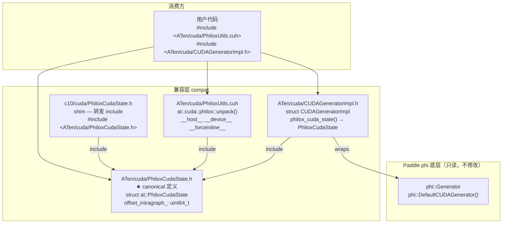

##### Philox CUDA RNG 头文件 API 兼容性

✅ 表示已经支持
🚧 表示正在支持
❌ 表示不准备支持
🔧 表示部分支持（有功能限制）

**涉及文件**：
- `ATen/cuda/PhiloxCudaState.h`（canonical 定义）
- `c10/cuda/PhiloxCudaState.h`（shim，转发至 ATen 路径）
- `ATen/cuda/PhiloxUtils.cuh`（`unpack` 内联实现）

---

### 兼容方式架构图

**架构说明**：
- `ATen/cuda/PhiloxCudaState.h` 是唯一 canonical 定义，直接对齐 PyTorch 上游（`aten/src/ATen/cuda/detail/PhiloxCudaStateRaw.cuh`）。
- `c10/cuda/PhiloxCudaState.h` 退化为纯 shim，只做路径转发，确保通过任一路径 include 均使用同一个类型定义，不存在 ODR 违规。
- `CUDAGeneratorImpl.h` 直接 include ATen canonical 路径，不再经过 c10 shim。
- `PhiloxUtils.cuh` 仅保留 `unpack()` 内联实现；`unpack_cudnn`/`unpack_cudnn_wrapper` 推迟到后续 PR 补充。

---

### `at::PhiloxCudaState` 结构体

| 字段 | 类型 | 说明 |
|------|------|------|
| `seed_` | `union Payload { uint64_t val; int64_t* ptr; }` | 种子值或图捕获时的设备指针 |
| `offset_` | `union Payload { uint64_t val; int64_t* ptr; }` | 偏移值或图捕获时的设备指针 |
| `offset_intragraph_` | `uint64_t` | 图内偏移增量（graph capture 专用） |
| `captured_` | `bool` | 是否处于 CUDA graph capture 状态 |

---

### `at::PhiloxCudaState` 构造函数

| torch API | paddle API 兼容性 | 测试用例状态 | 优先级 | 备注 |
|-----------|------------------|--------------|--------|------|
| `PhiloxCudaState()` | ✅ | ✅ | P0 | 默认构造，`captured_ = false` |
| `PhiloxCudaState(uint64_t seed, uint64_t offset)` | ✅ | ✅ | P0 | 非 graph capture 场景 |
| `PhiloxCudaState(int64_t* seed, int64_t* offset_extragraph, uint64_t offset_intragraph)` | ✅ | ❌ | P1 | graph capture 场景；需 device 指针，测试需 CUDA graph 环境 |

---

### `at::cuda::philox` 命名空间函数

| torch API | paddle API 兼容性 | 测试用例状态 | 优先级 | 备注 |
|-----------|------------------|--------------|--------|------|
| `unpack(PhiloxCudaState)` | ✅ | ✅ | P0 | `__host__ __device__ __forceinline__`，返回 `(seed, offset)` tuple |
| `unpack_cudnn(PhiloxCudaState, int64_t*, int64_t*)` | ❌ | - | P1 | 需要 CUDA kernel 实现，推迟到后续 PR |
| `unpack_cudnn_wrapper(PhiloxCudaState, int64_t*, int64_t*, cudaStream_t)` | ❌ | - | P1 | 需要 CUDA kernel 实现，推迟到后续 PR |

---

### 兼容性历史

| 日期 | 变更 | 说明 |
|------|------|------|
| 2026-02-28 | 新增 `ATen/cuda/PhiloxCudaState.h` 和 `ATen/cuda/PhiloxUtils.cuh` | PR #78072 初始提交 |
| 2026-03-22 | 统一 `PhiloxCudaState` canonical 定义 | 将 `c10/cuda/PhiloxCudaState.h` 改为 shim，修复 ODR/ABI mismatch；删除 `_PD_Internal_GetDefaultPhiloxCudaState` 实验接口；移除未实现的 `unpack_cudnn`/`unpack_cudnn_wrapper` 声明；补充 `ATen_philox_test.cc` 兼容性测试 |
