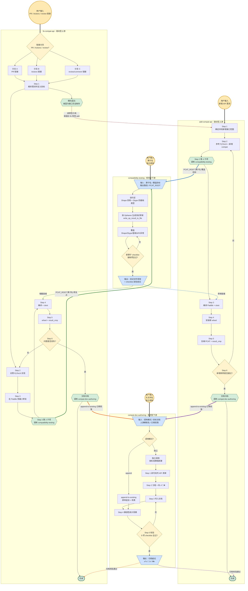

# Skill 互相调用流程图

> 配套 `.github/skills/` 下四个 SKILL.md 的全局视图：
> [add-compat-api](../.github/skills/add-compat-api/SKILL.md) /
> [fix-compat-api](../.github/skills/fix-compat-api/SKILL.md) /
> [compatibility-testing](../.github/skills/compatibility-testing/SKILL.md) /
> [compat-doc-authoring](../.github/skills/compat-doc-authoring/SKILL.md)
>
> 配套源文件：[skill-flow.drawio](skill-flow.drawio)

## 总览（Mermaid）

## 图例

| 元素 | 含义 |
|------|------|
| 圆角矩形 `((U1))` | 用户起点（每个 skill 都可作为起点） |
| 方框 `[Step N]` | skill 内部 Step |
| 菱形 `{判定}` | 条件分支或循环判定 |
| 六边形 `{{跨 skill 调用点}}` | 触发跨 skill 调用的子步骤 |
| 平行四边形 `[/IO/]` | 下游 skill 的输入/输出契约 |
| 椭圆 `([完成])` | skill 终态 |
| **粗实线** `==>` | 自动跳转（Claude 在该节点会发起 Skill 工具调用） |
| 细虚线 `-.->` | 回流路径（下游产出后续接到调用方下一步） |
| 标注 `说明性引用` 的虚线 | **人工切换**（不自动触发，避免双驱动循环递归） |

## 起点与回流速查

- **U1（新增 API 需求）** → add-compat-api: A1 → A2 → A2_4 ⟹ T_IN ⟶ T_OUT ⟼ A3 → A4 → A5 → A6 ⟶ A_DOC ⟹ D_IN ⟶ D_OUT ⟼ A_DONE
- **U2（PR / Actions / review 链接）** → fix-compat-api: F0 → F1 → F2 → F3 → F3_3 ⟹ T_IN ⟶ T_OUT ⟼ F4 → F5 → F6 ⟶ F_DOC ⟹ D_IN ⟶ D_OUT ⟼ F_DONE
- **U2 触发横向退出**（接口完全缺失）→ fix-compat-api: F0 → F1 → F_EXIT ⤳ A1（**人工切换**）
- **U3（独立写测试）** → compatibility-testing: T_IN → T1 → T2 → T3 → T_CHK → T_OUT（无跨 skill 调用）
- **U4（独立写文档）** → compat-doc-authoring: D_IN → D_MODE(独立) → D_STD → D1 → ... → D5 → D_OUT（无跨 skill 调用）

## 防循环约束（图未画出但规则强制）

- `compatibility-testing` 与 `compat-doc-authoring` 节点**只接收上游传入、产出后回流，绝不主动指向 add/fix 内部节点**
- `F_EXIT → A1` 是图上唯一的横向跨 skill 边，且标注为"说明性引用"，靠人工/Claude 显式切换，不发起 `Skill(skill=..., ...)` 工具调用
- 下游 skill 的 SKILL.md 在"上游调用上下文"段已显式声明 "**不反向调用任何上游 skill，也不触发其他 skill**"，从规则层面与图拓扑层面双重切断循环路径

## draw.io 版本

源文件：[skill-flow.drawio](skill-flow.drawio)

打开方式：

- VSCode：安装 [Draw.io Integration](https://marketplace.visualstudio.com/items?itemName=hediet.vscode-drawio) 插件后直接双击 `.drawio`
- 在线编辑：上传至 [https://app.diagrams.net](https://app.diagrams.net)
- 导出：建议导出为 `skill-flow.svg`（`File → Export As → SVG`），便于 README / Wiki 嵌入

## 维护约束

1. 修改 4 个 SKILL.md 的 Step 划分或跨 skill 调用边时，**必须同步**更新 `skill-flow.md` 与 `skill-flow.drawio`
2. 不在 SKILL.md 内嵌任何 Mermaid 代码块——所有流程图维护点收敛在本文件
3. 新增 skill 时，先在本流程图中加节点和边、再去新建 `.github/skills/<new-skill>/SKILL.md`，避免拓扑漂移
4. 横向跨 skill 边只允许"说明性引用"（虚线 + `请退出 ... 改用 ...` 文字），禁止自动 `Skill(skill=..., ...)` 调用，防止双驱动循环递归
