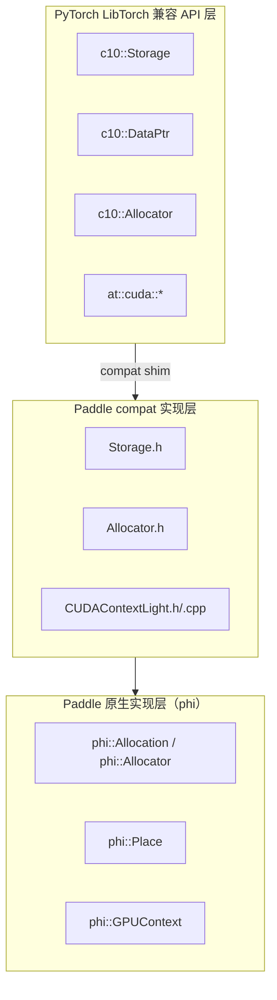
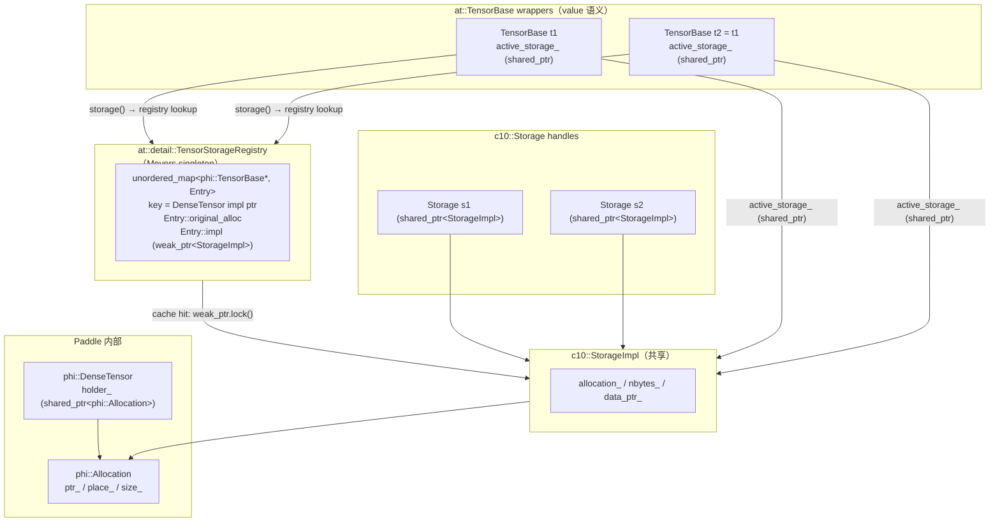
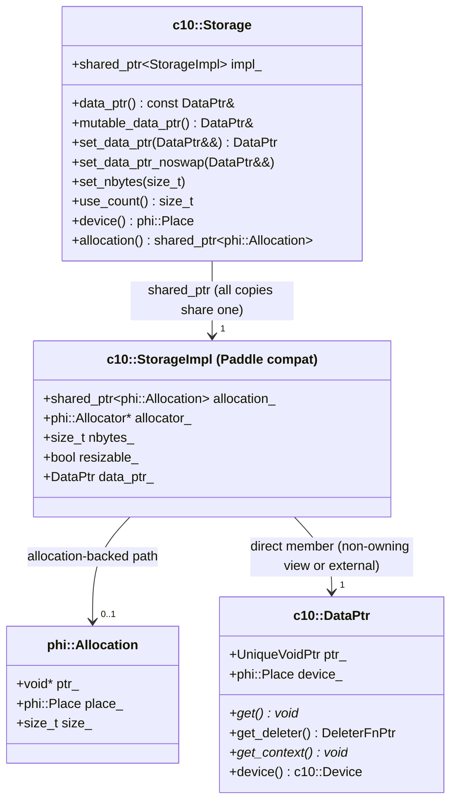
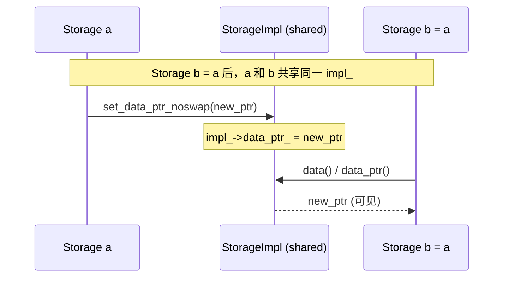
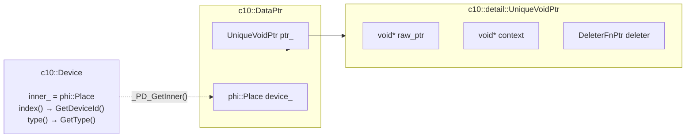
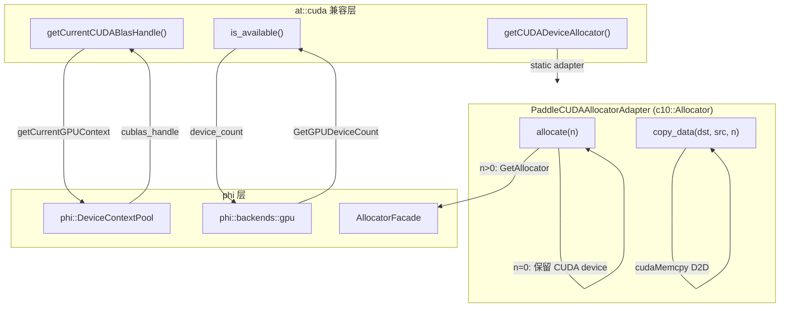

# Paddle compat 层兼容方式架构图

本文档说明 Paddle compat 层如何将 PyTorch 的 `c10::Storage` / `c10::DataPtr` 接口映射到 Paddle 内部实现。

---

## 整体分层架构



---

## TensorBase::storage() 跨 wrapper 共享机制（全局 TensorStorageRegistry）

PyTorch 中，所有 `TensorBase` wrapper 共享同一个 `TensorImpl`，因此 `TensorBase::storage()` 直接返回 `TensorImpl::storage_`，天然共享。在 Paddle compat 层中，`at::TensorBase` 是一个 value wrapper，不直接对应 PyTorch 的 `TensorImpl` 层级，无法在 `phi::DenseTensor` 上直接挂载 compat Storage 状态（`holder_` 是 protected 且无 setter），因此引入了全局 `at::detail::TensorStorageRegistry` 来实现跨 wrapper 的 `StorageImpl` 共享。



### 工作流程说明

1. `t1.storage()` 时：以 `DenseTensor*` 为 key 在注册表中查找。若无命中（cache miss），新建 `StorageImpl` 并写入注册表（注册表存 `weak_ptr`，不阻止销毁）；同时将 `t1.active_storage_`（`shared_ptr`）指向该 `StorageImpl`，tensor 自身成为一个持有者。
2. `t2 = t1`（同一底层 DenseTensor）调用 `t2.storage()` 时：注册表命中，`weak_ptr.lock()` 成功，返回与 s1 共享同一 `StorageImpl` 的 handle；同时设置 `t2.active_storage_`（`shared_ptr`）。
3. 通过 s1 调用 `set_data_ptr_noswap(new_alloc)` 后：`StorageImpl::data_ptr_` 被修改；s2 的 `data()` 和 `t1.data_ptr()` / `t2.data_ptr()` 均通过 `active_storage_` 读到新地址。
4. 外部 Storage handle（s1、s2）全部释放后：tensor 的 `active_storage_`（`shared_ptr`）仍持有 `StorageImpl`，保证 mutation 不丢失；`StorageImpl` 在 TensorBase 析构后才随 `active_storage_` 析构而销毁，届时注册表的 `weak_ptr` 自动过期，下次调用 `storage()` 时自动重建。

---

## c10::Storage 共享 StorageImpl 设计

Paddle compat 的 `Storage` 采用与 PyTorch 相同的 **shared handle** 设计：多个 `Storage` 副本共享同一个 `StorageImpl`，通过任意副本的 `set_data_ptr*()`/`set_nbytes()`/`mutable_data_ptr()` 写操作均对所有副本可见。



### 架构说明

| 属性 | PyTorch StorageImpl | Paddle compat StorageImpl |
|------|---------------------|---------------------------|
| Storage handle | `intrusive_ptr<StorageImpl>` | `shared_ptr<StorageImpl>` |
| 数据所有权 | `DataPtr data_ptr_`（直接成员） | `DataPtr data_ptr_`（直接成员，与 PyTorch 相同） |
| allocation-backed | 无（直接通过 DataPtr） | `shared_ptr<phi::Allocation>`（额外保存） |
| DataPtr 视图 | 由 Allocator 的 deleter 管理 | 对 phi::Allocation：非拥有性原始指针视图；外部 DataPtr：直接存储 |
| 设备信息来源 | `data_ptr_.device()` | `allocation_->place()` 或 `data_ptr_.device()` |
| 引用计数来源 | `intrusive_ptr` 计数 | 统一使用 `impl_.use_count()`（所有持有同一 StorageImpl 的 `Storage` handle 数量 + tensor 自身的 `active_storage_` 引用） |
| copy-on-write | 无（single StorageImpl） | 无（已移除 CoW；共享 impl_ 直接传播写操作） |

### use_count() 计算依据

```cpp
size_t use_count() const {
    if (!valid()) return 0;
    return impl_.use_count();
}
```

- **统一返回 `impl_.use_count()`**：反映所有持有该 `StorageImpl` 的强引用总数，包括 `Storage` handle 和 tensor 的 `active_storage_`（`shared_ptr`）引用，与 PyTorch `TensorImpl` 自身也持有 `Storage` handle 的语义一致
- **典型计数示例**：单 tensor + 一个 Storage handle：`use_count == 2`（tensor 的 `active_storage_` + 外部 handle）；两个共享底层 DenseTensor 的 wrapper 各持有一个 Storage handle：`use_count == 4`
- **空/无效 Storage**：`valid()` 返回 false 时返回 0（即既无 allocation 也无有效 DataPtr 时）
- **不再计入内部引用**：旧实现在 allocation-backed 路径返回 `allocation_.use_count()`，会将 `DenseTensor::holder_`、`StorageImpl::allocation_` 等内部保活引用计入，导致单 tensor 场景报告 4，共享 tensor 场景报告 5。新实现只统计 `StorageImpl` 的 `shared_ptr` 持有者数量，行为符合 PyTorch 预期。

### Reference Semantics：写操作传播示意



---

## c10::DataPtr 与 phi::Place 的映射



---

## at::cuda 接口映射（CUDAContextLight）



### at::cuda::getCUDADeviceAllocator()

提供 Paddle CUDA Allocator 的 `c10::Allocator` 适配：

```cpp
c10::Allocator* getCUDADeviceAllocator() {
    static PaddleCUDAAllocatorAdapter adapter;
    return &adapter;
}
```

`PaddleCUDAAllocatorAdapter` 将 `phi::AllocatorFacade` 的 GPU 分配器包装为 `c10::Allocator` 接口：

| 方法 | 行为 |
|------|------|
| `allocate(0)` | 返回 `DataPtr(nullptr, nullptr, nullptr, Device(CUDA, current_device_id))`，保留当前 CUDA 设备信息，不触发实际分配 |
| `allocate(n>0)` | 通过 `AllocatorFacade` 在当前 GPU 上分配，所有权通过 `deletePaddleCUDAAllocation` deleter 管理 |
| `copy_data(dst, src, n)` | 使用 `cudaMemcpy(dst, src, n, cudaMemcpyDeviceToDevice)` 实现 GPU-to-GPU 拷贝，兼容 `c10::Allocator::clone()` 语义 |
| `raw_deleter()` | 返回 `nullptr`，表示 raw API 不可用。`c10::Allocator` raw 契约要求 `allocate(n)` 返回的 DataPtr 满足 `get()==get_context()`，但本实现中 `data=device_ptr`、`context=phi::Allocation*`，两者不等，因此不能宣称 raw API 可用（PR #78060 当轮修复）。 |

---

## 注意事项

1. **StorageImpl 共享设计**：`Storage b = a` 后两者共享同一个 `StorageImpl`。任何通过 a 或 b 的写操作（`set_data_ptr*`、`set_nbytes`、`mutable_data_ptr` 返回引用后修改）立即对另一方可见。这与 PyTorch 中 `Storage` 作为 `intrusive_ptr<StorageImpl>` handle 的语义一致。

2. **独立 Storage 互不影响**：`Storage a(alloc1); Storage b(alloc2)` 各自持有独立的 `StorageImpl`，写操作不跨越 impl 边界。

   **TensorBase::storage() 跨 wrapper 引用语义**：`TensorBase::storage()` 通过全局 `TensorStorageRegistry` 保证：对同一底层 `phi::DenseTensor`（相同 impl 指针）的所有 `at::TensorBase` wrapper，不论是否由同一对象的多次调用还是 copy 后的不同 wrapper 调用，都返回共享同一 `StorageImpl` 的 handle，与 PyTorch 中所有 wrapper 共享同一 `TensorImpl::storage_` 的语义一致：

   ```cpp
   at::TensorBase t1 = paddle::ones({2, 3});
   at::TensorBase t2 = t1;                    // 同一底层 DenseTensor
   c10::Storage s1 = t1.storage();
   c10::Storage s2 = t2.storage();            // s1 和 s2 共享同一 StorageImpl
   s1.set_data_ptr_noswap(new_alloc);
   assert(s2.data() == s1.data());            // ✅ 跨 wrapper 修改对 s2 可见
   assert(t1.data_ptr() == new_alloc->ptr()); // ✅ TensorBase::data_ptr() 也感知新地址
   ```

   实现机制：全局 `at::detail::TensorStorageRegistry`（Meyers singleton，`std::mutex` + `std::unordered_map`），以 `phi::TensorBase*`（DenseTensor impl 指针）为 key，存储 `std::weak_ptr<StorageImpl>`（注册表不延长 StorageImpl 生命周期）。每个 `TensorBase` 实例持有 `mutable std::shared_ptr<c10::StorageImpl> active_storage_`，在 `storage()` 首次调用时设置：(1) 使 tensor 自身计入 `use_count()`，对齐 PyTorch `TensorImpl` 持有 `Storage` handle 的语义；(2) 保证通过 `set_data_ptr_noswap()` 写入的 mutation 在外部 Storage handle 全部析构后仍存活于 tensor 中。

3. **phi::Allocation DataPtr 视图**：allocation-backed 路径中，`impl_->data_ptr_` 是对 `phi::Allocation` 的非拥有性视图（只含原始指针 + device，无 deleter），引用计数由 `impl_->allocation_` 独立维护，`use_count()` 不会因 DataPtr 的存在而虚增。

4. **多卡 device index 保留**：`phi::GPUPlace(n)` 的 device id 为 `n`，通过 `phi::Place::GetDeviceId()` 可完整读回，因此 `DataPtr::device().index()` 在多卡场景下返回正确值。
