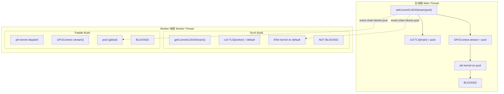
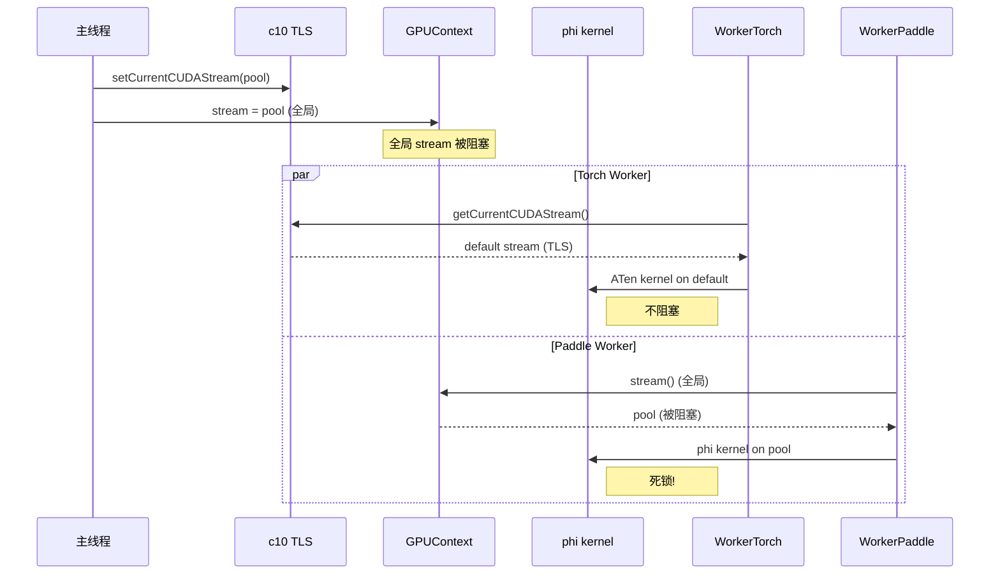
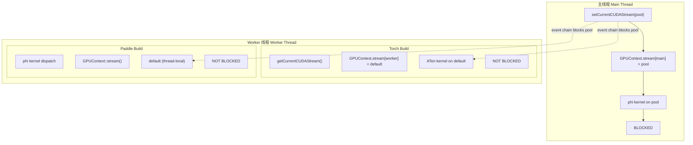
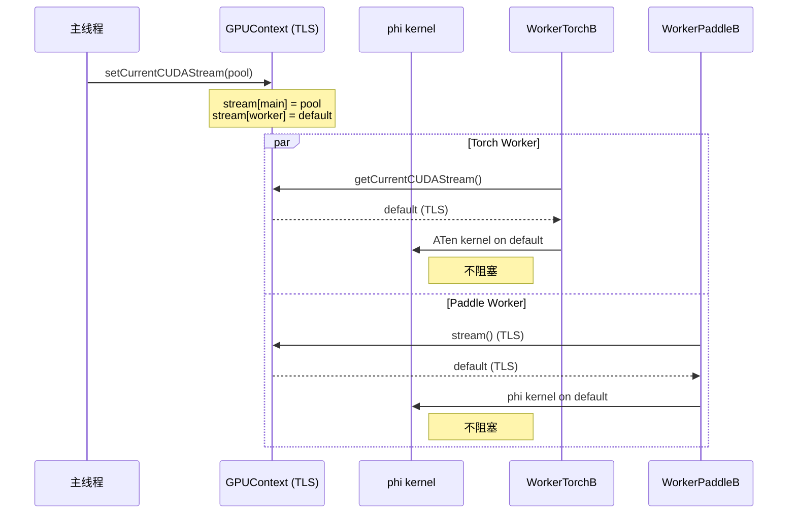
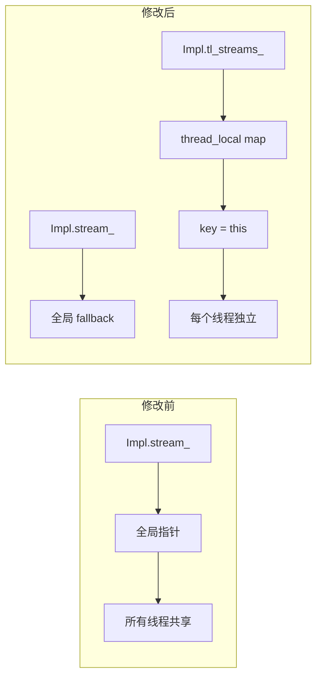

# Thread-Local Stream 两种设计方案对比

## 背景

Paddle phi kernel 使用 `GPUContext::stream()` 提交 CUDA kernel，而 `GPUContext` 是 per-device 全局单例。这意味着所有线程共享同一个 stream。当主线程设置了一个被阻塞的 stream，worker 线程的 phi kernel 也会提交到同一个被阻塞的 stream 上，导致死锁。

PyTorch 的 ATen kernel 使用 `c10::cuda::getCurrentCUDAStream()`（thread-local）提交 kernel，每个线程有自己的 stream，不会相互影响。

---

## 方案 A：c10 compat 层维护独立 TLS（当前 PR #78902）

### 架构图

### 数据流

### 优点

1. **修改集中**：只改 c10 compat 层两个文件（`CUDAStream.cpp/h`）
2. **向后兼容**：非 compat 模式完全不受影响
3. **零耦合**：不需要改 phi kernel dispatch 逻辑

### 缺点

1. **治标不治本**：phi kernel 仍然使用 GPUContext 全局 stream，死锁问题在 phi kernel 路径仍然存在
2. **两套语义**：c10 TLS 和 GPUContext stream 不一致，c10 caller 和 phi kernel 看到不同的 stream
3. **维护负担**：所有通过 c10 调用的代码走 TLS，所有 phi kernel 走全局，容易混淆

---

## 方案 B：GPUContext 本身使用 Thread-Local Stream

### 架构图

### 数据流

### 核心修改

### 优点

1. **治本**：phi kernel 和 c10 compat 层看到同一个 thread-local stream，彻底解决死锁
2. **语义统一**：不再有"c10 TLS vs GPUContext 全局"的分裂
3. **PyTorch 对齐**：行为与 PyTorch 完全一致（所有 kernel 都使用 thread-local stream）

### 缺点

1. **修改面较广**：需要改 `GPUContext::Impl` 的 stream 访问逻辑
2. **Allocator 问题**：`SetStream` 同时更新 allocator，如果 allocator 也是全局的，可能需要同步处理
3. **Handle 重置**：Eigen/BLAS/DNN handle 绑定到 stream，stream 变化后可能需要重置 handle（原 TODO）
4. **向后兼容**：现有代码假设 GPUContext stream 是全局的，需要验证是否有代码依赖这个假设

---

## 关键差异对比

| 维度 | 方案 A (c10 TLS) | 方案 B (GPUContext TLS) |
|---|---|---|
| **修改文件数** | 2 个文件 (CUDAStream.cpp/h) | 1 个文件 (gpu_context.cc) |
| **phi kernel 死锁** | 仍然存在 | 解决 |
| **c10/phi 语义一致性** | 两套 stream | 统一 |
| **向后兼容性** | 完全兼容 | 需验证 |
| **PR #78652 影响** | 保持现有修复 | 可回退 c10 特殊处理，简化代码 |
| **PyTorch 对齐度** | 部分对齐 (c10 层) | 完全对齐 |

---

## 结论建议

**短期**：方案 A 已足够修复 c10 compat 层的 FastDeploy 问题（PR #78652）。

**长期**：方案 B 是正确架构，因为：
1. phi kernel 是 Paddle 的核心执行路径，不能长期容忍全局 stream 死锁
2. 与 PyTorch 的语义差异是 Paddle C++ API 兼容性的根本障碍
3. `DeviceContextPool` 设计本应是 per-thread 的（PyTorch 的 DeviceGuard 就是 thread-local）

**实施路径**：
1. 先在一个实验分支实现方案 B
2. 跑通 Paddle 全量单测，确认无回归
3. 跑通 PaddleCppAPITest 死锁复现测试，确认 paddle 输出从 `0` 变 `1`
4. 逐步合并到 develop
