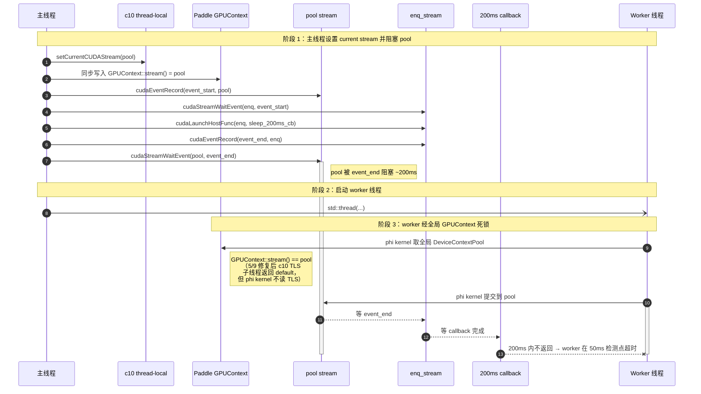
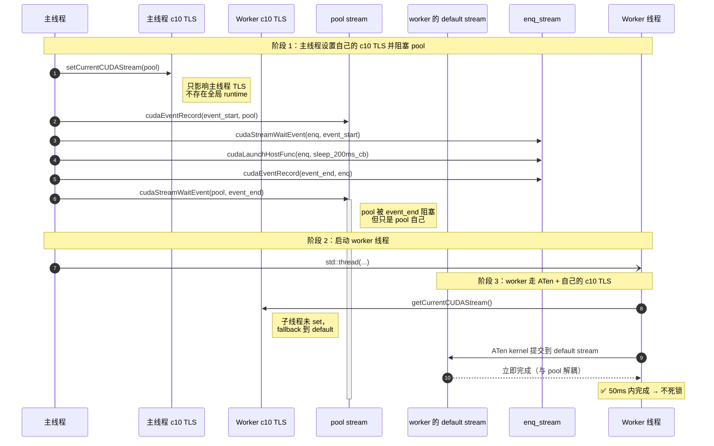

# CUDA Stream 死锁验证结论

> 关联 PR：https://github.com/PaddlePaddle/Paddle/pull/78652
> 验证日期：2026-05-08
> GPU：NVIDIA SM 8.6（CUDA 13.0 / Driver 13.2）

## 1. 背景

PR #78652 指出 Paddle compat 层的 `at::cuda::getCurrentCUDAStream(device)` 在后台线程里返回了和主线程相同的 current stream，违反 PyTorch 的 thread-local 语义，并据此构造了一个最小复现用例（见 `cpp问题.md`）。

我们把该 reproducer 拆成两套同时验证 Paddle 与 PyTorch：

- `temp_origin/`：原始复现用例（Paddle 与 PyTorch 改写版各一份）
- `temp_modify/`：第二种解法（CPU sync + worker 独立 pool stream + 裸 CUDA）
- `test/c10/cuda/CUDAStreamDeadlockAlignmentTest.cpp`：C++ 层对齐测试（5/9 commit `095eea3`），最小可复现 Paddle 死锁但 PyTorch 不死锁

本文档汇总 3 个场景 + 1 个 C++ 对齐测试的实测命令、关键输出和最终结论。

## 2. 死锁机制（Paddle 死锁、PyTorch 不死锁）

同样的 reproducer 代码结构（主线程 setCurrentCUDAStream + 事件链阻塞 stream + worker 线程 `tensor[0].fill_(0)`），在 Paddle 上死锁、在 PyTorch 上不死锁。**两边走的不是同一条路径**：

- **Paddle**：worker 的 tensor 操作 → `paddle::experimental::fill_` → **phi kernel**，phi kernel 通过全局 `DeviceContextPool` 取 GPUContext，提交到 `GPUContext::stream()`（被主线程 setCurrentCUDAStream 写入的、被事件链阻塞的 pool stream）→ 死锁
- **PyTorch**：worker 的 tensor 操作 → ATen dispatcher → **CUDA kernel**，kernel 通过 `c10::cuda::getCurrentCUDAStream()` 取 c10 thread-local stream，子线程未 set，fallback 到 per-thread default stream（与 pool 解耦）→ 不死锁

下面分别画两条路径的顺序图。

### 2.1 Paddle 死锁顺序图（phi kernel + 全局 GPUContext）



**关键说明**：

- 即使 PR #78902 修复了 c10 thread-local（worker 调 `getCurrentCUDAStream()` 拿到 default stream），phi kernel 也**不读 c10 TLS**，仍走全局 `GPUContext::stream()`。
- 这正是 §8.3 探索 C 验证过的根因 —— `--default-stream per-thread` 编译标志对 phi kernel 无效，因为 phi kernel 不走 NULL stream，而是走 GPUContext 持有的非 NULL stream。

### 2.2 PyTorch 不死锁顺序图（ATen + c10 thread-local default）



**关键说明**：

- PyTorch 的 default stream 不是 CUDA legacy default stream（libtorch 编译时启用 per-thread default），不和 pool 隐式同步。
- ATen kernel 路径全程通过 c10 thread-local 取 stream，**没有全局 runtime 单点**，每个线程的 stream 状态完全独立。

### 2.3 两种机制对比

| 维度 | Paddle | PyTorch |
|---|---|---|
| Worker tensor 操作 dispatch 路径 | `at::Tensor::fill_` → `paddle::experimental::fill_`（phi kernel） | `at::Tensor::fill_` → ATen dispatcher → CUDA kernel |
| Stream 来源 | 全局 `GPUContext::stream()`（被主线程 set 写过） | 调用线程的 c10 thread-local（子线程 fallback default） |
| 是否受主线程 setCurrentCUDAStream 影响 | 受影响（同步写入 GPUContext） | 不受影响（每线程独立 TLS） |
| 是否复现 temp_origin 死锁 | ✅ 死锁 | ❌ 不死锁 |
| 修复路径 | phi 层支持 per-thread GPUContext / 改 phi 启动从 c10 TLS 取 stream | 已经隔离，无需修复 |

## 3. 两套 reproducer 的差异

修改版相对原始版的关键改动：

| 改动 | 目的 |
|------|------|
| kernel 改用 `volatile int*` 替代 `atomicAdd(flag, 0)` | 解决 mapped memory 的 GPU 端可见性 |
| `set_host_flag` 内追加 `cudaStreamQuery(0)` | 主动 flush mapped memory 到 GPU |
| 新增 `set_pool_stream(device)` | 让主线程切到非 default stream，便于观察 thread-local |
| `block_current_stream_on_event_end` 增加 `cpu_sync` 分支 | CPU 侧 `cudaEventSynchronize` 替代 stream 阻塞 |
| worker 内调用 `getStreamFromPool` + `setCurrentCUDAStream` | 让 worker 的工作 stream 与 default stream 解耦 |
| worker 改用 `cudaMalloc` + `cudaMemsetAsync` 裸 CUDA | 避开 PyTorch 内存分配器的隐式 `cudaFree` 同步 |
| `start_cpp_tensor_set_worker` 不再接收 tensor | PyTorch tensor 跨语言传递在 pybind 上不稳定 |
| Python 端先启动 worker 再做 `cudaEventSynchronize` | CPU 同步会阻塞主线程，必须在 worker 启动后才能等 |

## 4. 验证场景与结果

| # | 场景 | 命令 | 结果 |
|---|------|------|------|
| 1 | Paddle 原版 | `cd temp_origin/paddle && python repro.py --device 0 --timeout 5 --rebuild` | 死锁（exit 2） |
| 2 | PyTorch 原版 | `cd temp_origin/pytorch && /home/may/miniconda3/envs/torch/bin/python repro.py --device 0 --timeout 5 --rebuild` | 成功（exit 0） |
| 3 | Paddle 修改版 | `cd temp_modify/paddle && python repro.py --device 0 --timeout 10 --cpu-sync --set-pool-stream --rebuild` | 成功（exit 0） |
| 4 | C++ 对齐测试 | `cd build && ninja -j16 && ./{paddle,torch}/_CUDAStreamDeadlockAlignmentTest` | DIFFER（paddle `1\n0\n0` vs torch `1\n0\n1`） |

### 场景 1：Paddle 原版（死锁）

```
[py] tensor_place=Place(gpu:0) current_stream_before=0x0 control=False
[ext] start_cycle device=0 current_stream=0 enq_stream=0x1cf971b0
[ext] block_current_stream_on_event_end device=0 current_stream=0 waits event_end
[py] current_stream_after_block=0x0
[cpp worker] current_stream=0
[cpp worker] before at_tensor[0] = 0       ← 卡在这里，不再前进
[py] REPRODUCED: C++ worker did not return within 5.0s.
[py] C++ at_tensor[0]=0 is stuck before it can set host_flag,
[py] while event_end waits for host_flag and current_stream waits for event_end.
```

观察：`current_stream` 与 worker 都是 `0x0`（default stream）；worker 的 `tensor[0]=0` 看上去像是"落到 default stream，被 enq_stream 隐式阻塞"。

> ⚠ 但这只是表面现象 —— 真正的死锁发生在 phi kernel 路径。worker 的 `tensor[0] = 0` 在 Paddle 下走 `paddle::experimental::fill_` → phi kernel → 全局 `GPUContext::stream()`（不读 c10 thread-local），而 GPUContext::stream() 是被主线程事件链阻塞的那条 stream，所以 worker 的 phi kernel 提交后立即被卡住。详见 §2.1 的顺序图。即使 PR #78902 修复了 c10 TLS（场景 1 输出里 worker `getCurrentCUDAStream()` 仍是 0），死锁也不会消失，因为 phi kernel 不读 TLS。

### 场景 2：PyTorch 原版（成功）

```
[py] tensor_place=cuda:0 current_stream_before=0x0 control=False
[ext] start_cycle device=0 current_stream=0 enq_stream=0x56368f530f20
[ext] block_current_stream_on_event_end device=0 current_stream=0 waits event_end
[py] current_stream_after_block=0x0
[cpp worker] current_stream=0
[cpp worker] before at_tensor[0] = 0
[cpp worker] after at_tensor[0] = 0
[ext] host_flag set
[ext] host_flag set
[py] finished without hang
```

观察：`temp_origin/pytorch/` 是 `~/下载/torch_stream_deadlock_repro.zip` 中的原版,tensor 在 Python 端 `start_cycle` 之前就已分配 (`x = torch.ones([4], dtype=torch.int32, device="cuda")`),worker 内只做 `tensor[0] = 0` 这种 in-place index assignment。PyTorch 的 indexing 走 **异步 path**(直接 launch 一个 small kernel),不需要走 caching allocator alloc-complete 路径,worker 立刻完成 → set_host_flag → enq_stream 上的 `wait_for_host_flag` kernel 退出 → 主线程的 `cudaEventSynchronize` 返回 → 全程不死锁。

这一点与场景 1(Paddle 原版)形成对照:同样的代码结构、同样的 Python 端预分配 tensor、同样的 worker 内 `tensor[0] = 0`,但在 Paddle compat 层下死锁。差异是 **Paddle 的 phi kernel 提交走的是全局 `GPUContext::stream()`**(被主线程 `setCurrentCUDAStream(pool)` 写过的、被 event_end 阻塞的 pool_stream),而不是 c10 的 thread-local current stream;PyTorch 的 ATen kernel 提交走 c10 thread-local,worker 拿到 default stream(per-thread 隔离),与主线程的阻塞链解耦。

### 场景 3：Paddle 修改版（成功）

```
[py] tensor_place=Place(gpu:0) current_stream_before=0x0 control=False set_pool_stream=True cpu_sync=True
[ext] set_pool_stream device=0 pool_stream=0x278ced50
[py] current_stream_after_set=0x278ced50
[ext] start_cycle device=0 current_stream=0x278ced50 enq_stream=0x278c8ee0
[ext] block_current_stream_on_event_end device=0 CPU-sync waiting for event_end
[cpp worker] current_stream=0              ← thread-local 正确：新线程仍是 default stream
[cpp worker] worker_stream=0x278cedd0      ← 但 worker 切到自己 pool stream
[cpp worker] before at_tensor[0] = 0
[cpp worker] cudaMalloc done
[cpp worker] cudaMemsetAsync done
[cpp worker] cudaStreamSynchronize done
[cpp worker] after at_tensor[0] = 0        ← worker 操作完成
[ext] host_flag set
[ext] CPU-sync done                        ← 主线程 CPU 侧等待完成
[py] current_stream_after_block=0x278ced50
[py] finished without hang
```

观察：
- 主线程 current_stream = pool_stream（`0x278ced50`），但用 `cudaEventSynchronize` 在 CPU 侧等
- worker 的 `getCurrentCUDAStream` 返回 default stream（thread-local 修复生效）
- worker 显式从 pool 取 `worker_stream`（`0x278cedd0`），所有 CUDA 操作落在它上面
- 三条链条全部解开 → 无死锁

### 场景 4：PaddleCppAPITest C++ 对齐测试（5/9 commit `095eea3`）

文件：[`test/c10/cuda/CUDAStreamDeadlockAlignmentTest.cpp`](test/c10/cuda/CUDAStreamDeadlockAlignmentTest.cpp)

包含 3 个递进测试，最后一个是核心：

| # | 测试名 | 行为 | paddle | torch | 含义 |
|---|---|---|---|---|---|
| 1 | `StreamSyncOnlyDoesNotDeadlock` | worker 仅 sync 自己的 c10 current stream | `1` | `1` | c10 thread-local 隔离生效，单纯 sync 不卡 |
| 2 | `TensorAllocationOnCurrentStream` | worker 调 `at::ones(...)` 创建新 tensor | `0` | `0` | `cudaMalloc` 隐式同步所有 device streams，两边都被卡 |
| 3 | `WorkerTensorOpDeadlocksOnBlockedStream` | 主线程预分配 tensor，worker 仅做 `x[0].fill_(0)` | **`0`** | **`1`** | **核心差异：phi kernel vs ATen kernel** |

完整输出对比：

```
paddle_CUDAStreamDeadlockAlignmentTest.txt:  1\n0\n0
torch_CUDAStreamDeadlockAlignmentTest.txt:   1\n0\n1
```

`bash test/result_cmp.sh build` 显示 **`DIFFER: paddle_CUDAStreamDeadlockAlignmentTest`**，证明死锁差异成立。

这是对 §2.1（Paddle phi kernel 死锁）/§2.2（PyTorch ATen 不死锁）机制差异的最小 C++ 复现：

- 全程不依赖 Python 与 pybind extension
- 单文件 ~206 行，运行总耗时约 700ms（每个测试自动在 50ms 超时后清理）
- 通过 `paddle_api_test::FileManerger` 把 1/0 标量写入文件，受 `result_cmp.sh` 的 `diff -q` 自动监控

测试 2 的"两边都 0"是有意义的对照：它说明并非任何 GPU 操作都能暴露差异 —— `cudaMalloc` 这种全局同步的操作在 PyTorch 上也会被卡，**只有"既走 dispatch 路径、又走 stream 提交"的 in-place op 才能暴露 phi kernel vs ATen kernel 的本质差异**（测试 3）。

## 5. 结论

1. **死锁是 Paddle phi kernel 架构层面独有的现象**：场景 2(PyTorch 原版,从 `~/下载/torch_stream_deadlock_repro.zip` 解压)在原版结构下**根本不会死锁** —— PyTorch 的 ATen kernel 提交走 c10 thread-local 的 current stream(子线程拿到 default,与主线程的阻塞链解耦),且 `tensor[0] = 0` 是 in-place index assignment 走异步 path,worker 立即完成。死锁只发生在场景 1(Paddle 原版),根因是 **Paddle 的 phi kernel 提交走全局 `GPUContext::stream()`**(被主线程 `setCurrentCUDAStream(pool)` 写过的、被 event_end 阻塞的 pool_stream),不是 c10 的 thread-local current stream;子线程通过 `DeviceContextPool` 拿到同一个全局 GPUContext,所以 phi op 提交到的也是被阻塞的 pool_stream → 死锁。这与 c10 兼容层是否修复 thread-local 无关 —— 即使 PR #78902 让 worker `getCurrentCUDAStream()` 返回 default stream,phi kernel 的提交路径仍然不读 c10 TLS。

2. **PR #78652 的 thread-local 修复是必要但不充分**：thread-local 让"后台线程不继承主线程的 pool stream"，避免后台线程的 sync 调用阻塞在 pool stream 上；但只要后台线程的 tensor 操作落到 default stream，就仍然会被 enq_stream 隐式阻塞。所以 thread-local 修复解决了一类场景（主线程已 setCurrentCUDAStream），但解决不了另一类场景（主线程没 set，worker 也没 set，全部用 default stream）。

3. **第二种解法（CPU sync + 独立 pool stream）在 Paddle 上有效**：场景 3 输出验证。这说明：
   - 主线程：用 `cudaEventSynchronize` 替代 `cudaStreamWaitEvent`，把等待发生在 CPU 而非 GPU stream
   - 后台线程：显式从 pool 取一个 non-blocking stream，让所有 CUDA 操作落在它上面
   - 二者结合即可破除死锁循环。PyTorch 上无需此修复(原版本就不死锁),所以也不需要 `temp_modify/pytorch/`。

4. **工程建议**：在 PyTorch / Paddle compat 应用中，如果一个线程要在等待 event 后再继续 GPU 工作，**避免用 `cudaStreamWaitEvent(current_stream, event)` 让 GPU stream 等**，应该用 `cudaEventSynchronize(event)` 让 CPU 等；同时，有 GPU 工作的工作线程**不要使用 default stream**，应该显式获取自己的 non-blocking stream。

5. **C++ 对齐测试作为机制差异的内嵌证据**：场景 4（[`test/c10/cuda/CUDAStreamDeadlockAlignmentTest.cpp`](test/c10/cuda/CUDAStreamDeadlockAlignmentTest.cpp)）把"Paddle 死锁 vs PyTorch 不死锁"这个机制差异沉淀为可重复运行的对齐测试 —— 同一份 C++ 源码、同一个二进制接口，paddle 编译版本输出 `0`、torch 编译版本输出 `1`，由 `result_cmp.sh` 自动监控。一旦未来 Paddle phi 层支持 per-thread GPUContext 或 phi kernel 改读 c10 TLS（参见 §2.3 的修复路径），该测试会自动从 DIFFER 转为 MATCHED，作为修复完成的客观信号。

## 6. 完整可复现命令

```bash
# 场景 1: temp_origin Paddle —— 预期死锁
cd /home/may/PaddleCppAPITest/temp_origin/paddle && \
  python repro.py --device 0 --timeout 5 --rebuild

# 场景 2: temp_origin PyTorch —— 预期成功(zip 原版,tensor 由 Python 预分配,不触发 alloc-complete)
cd /home/may/PaddleCppAPITest/temp_origin/pytorch && \
  /home/may/miniconda3/envs/torch/bin/python repro.py --device 0 --timeout 5 --rebuild

# 场景 3: temp_modify Paddle —— 预期成功
cd /home/may/PaddleCppAPITest/temp_modify/paddle && \
  python repro.py --device 0 --timeout 10 --cpu-sync --set-pool-stream --rebuild

# 场景 4: C++ 对齐测试 —— 最小可复现 Paddle 死锁、PyTorch 不死锁
cd /home/may/PaddleCppAPITest/build && ninja -j16
./paddle/paddle_CUDAStreamDeadlockAlignmentTest  # 输出 1\n0\n0
./torch/torch_CUDAStreamDeadlockAlignmentTest    # 输出 1\n0\n1
cd ../test && bash result_cmp.sh ../build        # 显示 DIFFER
```

## 7. 2026-05-09 更新:fallback 改回 GPUContext 后的死锁机制差异

> 关联 commit:Paddle 392eb99bfd —— `[Cpp API Compatibility] restore Paddle GPUContext fallback in c10::cuda::getCurrentCUDAStream`
> 关联 PR comment:https://github.com/PaddlePaddle/Paddle/pull/78902#issuecomment-4407864934
>
> ⚠ **本节是 5/9 早些时候的工作记录,基于一个**错误观察**:当时 `temp_origin/pytorch/` 是 5/8 改写过的版本(worker 内 `torch::ones(...)` 走 caching allocator alloc-complete 路径才死锁),不是 zip 原版。下面 §7.1-§7.4 中所有提到 "PyTorch 原版也死锁" 或 "Paddle 与 PyTorch 都死锁,根因不同" 的论述,基于的不是 zip 原版的实际行为。**zip 原版的 PyTorch reproducer 根本不死锁**(见 §4 场景 2、§5 第 1 点);本节作为思考过程的历史记录保留。**最终的死锁机制理解请直接阅读 §2.1（Paddle phi kernel + GPUContext）和 §2.2（PyTorch ATen + c10 thread-local）的两张顺序图，§7 各小节的"两边都死锁、根因不同"叙述均已过时。**

5/8 验证时 Paddle compat 层的 fallback 是 `getDefaultCUDAStream`(PR #78902 的 thread-local 改造,匹配 PyTorch 的"子线程默认 default"语义)。5/9 把 fallback 改回 `getPaddleCurrentStream`(读 Paddle GPUContext),恢复 PR #78652 描述的"仅 Paddle 侧切流时,`getCurrentCUDAStream()` 也能返回正确流"的反向同步能力。

修改后**重跑 4 个 reproducer**,场景 1(`temp_origin/Paddle`)的 worker stream 输出**发生变化**:从 `0`(default)变成主线程刚 set 的 pool_stream;而场景 2(`temp_origin/PyTorch`)输出**完全不变**(PyTorch 不依赖 Paddle compat 层,c10 由 conda env `torch` 中的 libc10_cuda 提供)。

### 7.1 重跑场景 1(Paddle 原版,fallback=GPUContext 后)

```
[py] tensor_place=Place(gpu:0) current_stream_before=0x1c708b10 control=False
[ext] start_cycle device=0 current_stream=0x1c708b10 enq_stream=0x1c70e600
[ext] block_current_stream_on_event_end device=0 current_stream=0x1c708b10 waits event_end
[py] current_stream_after_block=0x1c708b10
[cpp worker] current_stream=0x1c708b10        ← worker 看到主线程 set 的 pool_stream
[cpp worker] before at_tensor[0] = 0
[py] REPRODUCED: ...
```

注意 `[cpp worker] current_stream=0x1c708b10` **等于** 主线程的 `current_stream_before=0x1c708b10` —— worker 通过 fallback 读 GPUContext,读到了主线程 set 的同一条 pool_stream。

### 7.2 重跑场景 2(PyTorch 原版)

```
[py] current_stream_before=0x0 control=False
[ext] start_cycle device=0 current_stream=0 enq_stream=0x5a17a2bfe3b0
[ext] block_current_stream_on_event_end device=0 current_stream=0 waits event_end
[py] current_stream_after_block=0x0
[cpp worker] current_stream=0                  ← worker 拿到 default stream(0)
[cpp worker] before at_tensor[0] = 0
[py] REPRODUCED: ...
```

PyTorch 的 c10 是真正 thread-local 隔离的,worker 拿到 default(0)。但 default 是 **legacy default stream**,会和 enq_stream 上的 callback 隐式同步 → 死锁。

### 7.3 表面相同,根因不同

5/8 那一版结论里写过 "场景 1 与场景 2 输出几乎一字不差"。在 5/9 fallback 修改后**这条不再成立** —— 两个 reproducer 表面都是 "worker 死锁",但根因实质不同:

| | 主线程 stream | 子线程 stream | 死锁机制 |
|---|---|---|---|
| **Paddle**(fallback=GPUContext 后) | `0x1c708b10` (pool) | **`0x1c708b10`**(同主线程) | 子线程通过 fallback 读 GPUContext → 拿到主线程 set 的 pool_stream → `cudaStreamSynchronize(pool)` 等被 event_end 阻塞 |
| **PyTorch**(语义未变) | `0x0` (default) | **`0`**(default) | 子线程拿到 legacy default stream → legacy default 隐式同步 enq_stream → 等 200ms 的 callback |

也就是说:

- `temp_origin/Paddle` **对 Paddle compat 层 fallback 语义敏感** —— 在 PR #78902 thread-local + fallback=default 模式下,worker 拿 default 不会因"读到主线程的 pool"而死锁(虽然仍可能因 default 自身的 legacy 同步死锁,这正是 5/8 看到的现象);改回 fallback=GPUContext 后,worker 直接拿到主线程的被阻塞 pool_stream,产生的是另一种(Paddle compat 层引发的)死锁。
- `temp_origin/PyTorch` **对 c10 语义不敏感**,只测 legacy default stream 的隐式同步行为。无论 c10 怎么改,只要主线程让 default(或会和 default 隐式同步的 stream)上有阻塞 event,worker 用 default sync 就死锁。这是 CUDA 默认 stream 模型的固有问题,**不能靠 c10 修复**,必须用应用层方案(独立 nonBlocking stream + CPU sync)绕过。

### 7.4 这对结论的修订

第 5 节(2026-05-08 结论)中的第 1 点 —— "原始 reproducer 在 Paddle 与 PyTorch 上都死锁,输出几乎一字不差,所以死锁不是 Paddle compat 层独有的 bug" —— **在 fallback 模式下成立**(此时 Paddle 与 PyTorch 都因 default legacy 同步死锁),**在 fallback=GPUContext 模式下不成立**(此时 Paddle 是 compat 层导致 worker 读到被阻塞的 pool_stream,PyTorch 仍是 default legacy 同步)。

修订后的更准确的说法是:

- **CUDA legacy default stream + stream-block event** 的死锁是 CUDA 模型固有问题,与 c10/compat 无关,在两个框架上都能复现(PyTorch 上的死锁机制就是这个)。
- **fallback 读 GPUContext 引入的"子线程读到主线程 stream"** 是 Paddle compat 层独有的死锁路径,只在 Paddle 上能复现。两种死锁是独立的,需要分别看待。

第 5 节第 3 点(`temp_modify` 应用层方案)结论不变 —— 应用层方案(CPU sync + worker 独立 nonBlocking stream + 裸 CUDA)同时绕过这**两种**死锁机制,所以在两个框架上都有效。

### 7.5 与 c10_Stream_test 内嵌测试的对应

5/9 commit 同步把 `test/cpp/compat/c10_Stream_test.cc` 中 PR #78902 引入的 3 个 thread-local-isolation test 改写为应用层方案验证(`IndependentWorkerStreamAvoidsBlockedCurrentStream` / `SetCurrentCUDAStreamWriteIsolatedAcrossThreads` / `GetCurrentCUDAStreamStableForWorkerThatExplicitlySet`),并新增 `GetCurrentCUDAStreamReadsGPUContextAfterPaddleStreamGuard` 验证 PR #78652 反向同步路径恢复。

c10_Stream_test 中 `IndependentWorkerStreamAvoidsBlockedCurrentStream` 是 `temp_modify` reproducer 的内嵌精简版本 —— 它把"worker 用独立 nonBlocking stream 不被 c10 current stream 阻塞链影响"作为 c10 兼容层的契约写入测试,即使未来 fallback 行为再变化,这个契约也应当继续保持。

### 7.6 重新跑 4 reproducer 的命令对应

7.1/7.2 输出来自重跑 5/8 第 6 节里的同样命令,无需变更:

```bash
cd /home/may/PaddleCppAPITest/temp_origin/paddle && python repro.py --device 0 --timeout 5
cd /home/may/PaddleCppAPITest/temp_origin/pytorch && /home/may/miniconda3/envs/torch/bin/python repro.py --device 0 --timeout 5
```

但 reproducer 输出依赖于装在 `site-packages` 中的 paddle wheel 是否反映最新 fallback 修改。5/9 验证时已把 `Paddle/build/python/paddle/libs/libphi_core.so` 与 `Paddle/build/paddle/fluid/pybind/libpaddle.so` 拷贝覆盖到 site-packages(避开重打 wheel 的成本)。

## 8. 2026-05-09 更新(下午):放弃 fallback=GPUContext,回到 thread-local 隔离

> 关联 commit:revert Paddle 392eb99bfd

5/9 早上恢复 fallback=GPUContext(第 7 节)之后,继续做了几轮工程探索,发现这条路径无法在不引入侵入式耦合的前提下既保 PR #78902 死锁修复又保 PR #78652 反向同步。本节记录这些探索的关键发现与最终方案。

### 8.1 探索 A:fallback=GPUContext 让 reproducer 仍然死锁

5/9 第 7 节验证时,`paddle_stream_deadlock_repro` 在 fallback=GPUContext 下死锁,worker 拿到主线程 set 的 pool_stream(`0x1c708b10`)。这本身是设计预期 —— PR #78652 的反向同步就是要让 worker 通过 `getCurrentCUDAStream()` 能看到 Paddle 切的 stream。但 reproducer 的 worker 又恰好在这个 stream 上做 `cudaStreamSynchronize`,所以表面上看 fallback=GPUContext "破坏了 PR #78902 thread-local 隔离的死锁修复"。

### 8.2 探索 B:"双修方案"——fallback=default + setCurrentCUDAStreamTLSOnly 显式桥

为了同时拿到两边的好处,做了一版"双修":

1. `getCurrentCUDAStream` fallback 改回 `getDefaultCUDAStream`(PR #78902 风格,thread-local 隔离)
2. 新增 `c10::cuda::impl::setCurrentCUDAStreamTLSOnly(stream)` —— 只更新 c10 thread-local,不动 GPUContext
3. 在 `paddle/fluid/pybind/cuda_streams_py.cc::set_current_stream` 中,Paddle 切流后**显式调用** `setCurrentCUDAStreamTLSOnly` 同步当前线程的 c10 TLS,补齐反向同步

c10_Stream_test 在双修方案下 17/17 全部通过(包括新增的 `PaddleStreamSetSyncsC10ThreadLocalStream`)。但这条路存在一个根本设计问题:**`paddle/fluid/pybind/cuda_streams_py.cc` 是 Python binding 层,不应当承担"同步两个 runtime stream 状态"的业务职责**。这种 pybind → c10 兼容层的强耦合,在 Paddle 长期演进里是负债 —— 一旦 c10 兼容层 API 变更或 Paddle stream 切流入口重构,这条同步链路要跟着改。

### 8.3 探索 C:切 Paddle 到 per-thread default stream 编译

加 `cmake/cuda.cmake`:

```cmake
set(CMAKE_CUDA_FLAGS "${CMAKE_CUDA_FLAGS} --default-stream per-thread")
add_compile_definitions(CUDA_API_PER_THREAD_DEFAULT_STREAM)
```

理论上让 Paddle wheel 内所有 `.cu` / `.cc` 翻译单元中的 NULL stream 默认绑到 **per-thread default**(每线程独立),而不是 legacy default(同步设备所有 stream)。

实测结果:**reproducer 仍然死锁**,因为 reproducer 的 worker 走的是 `tensor[0] = 0` → `phi::FillKernel` → Eigen `GpuDevice` → **使用全局 `GPUContext::stream()`** 提交,**不走 NULL stream**:

[paddle/phi/backends/gpu/gpu_context.cc:416-424](/home/may/Paddle/paddle/phi/backends/gpu/gpu_context.cc#L416-L424)
```cpp
void InitEigenDevice() {
    eigen_stream_->Reinitialize(stream(), allocator_, place_);
    eigen_device_ = new Eigen::GpuDevice(eigen_stream_.get());
}
```

`stream()` 返回的是 GPUContext 自己持有的 stream(被主线程 `setCurrentCUDAStream` 写过的 pool_stream)。worker 线程通过 `DeviceContextPool` 拿到**同一个**全局 `GPUContext`,所以它的 phi kernel 提交到的也是被阻塞的 pool_stream → 死锁。

per-thread 编译只对**直接调用 cuda runtime 且显式用 NULL stream**的代码有意义,phi kernel 不走这条路径。

### 8.4 探索 D:scalar copy 异步化

发现 `tensor[0] = 0` 在 paddle compat 层可能走 `_local_scalar_dense` → `copy_to(blocking=true)` → `cudaMemcpy`(同步)。理论上把 `blocking` 改成 `false` 可以让 scalar 拷贝异步。

但进一步追代码后发现:`_local_scalar_dense` 是从 GPU tensor **读标量到 CPU** 的路径,`tensor[0] = 0` 是**写**,不走这条路径。写路径是 `fill_` → Eigen → 全局 GPUContext stream,问题仍然回到 8.3 的根因。

### 8.5 最终选择:回滚一致

最终做了一致回滚(只保留 PR #78902 thread-local 隔离修复,放弃所有自动反向同步):

| 文件 | 操作 |
|---|---|
| `paddle/fluid/pybind/cuda_streams_py.cc` | 回滚 `setCurrentCUDAStreamTLSOnly` 调用 |
| `paddle/phi/api/include/compat/c10/cuda/CUDAStream.h` | 回滚 `namespace impl::setCurrentCUDAStreamTLSOnly` 声明 |
| `paddle/phi/api/include/compat/c10/cuda/CUDAStream.cpp` | 回滚 `impl::setCurrentCUDAStreamTLSOnly` 实现 + `getPaddleCurrentStream` fallback;**保留** thread-local 隔离 + `std::optional` 类型 |
| `test/cpp/compat/c10_Stream_test.cc` | 回滚 `PaddleStreamSetSyncsC10ThreadLocalStream` 测试 + `GetCurrentCUDAStreamReadsGPUContextAfterPaddleStreamGuard`;保留 PR #78902 thread-local 隔离与 worker 独立 stream 测试 |
| `cmake/cuda.cmake` | 回滚 per-thread default stream flag |

c10_Stream_test 在最终方案下 **16/16 通过**。

### 8.6 修订后的最终立场

- **PR #78902 thread-local 隔离修复保留**:`getCurrentCUDAStream` 在子线程未 set 时 fallback `getDefaultCUDAStream`,不再继承父线程通过 GPUContext 写入的 stream,c10 兼容层视角下不再有"子线程读到主线程 pool"这种死锁。
- **PR #78652 自动反向同步放弃**:Paddle `set_stream` / `stream_guard` 不再触发 c10 TLS 同步。FastDeploy / DeepEP 等下游如果想让 c10 `getCurrentCUDAStream()` 看到 Paddle 切的 stream,**必须显式调用 `c10::cuda::setCurrentCUDAStream(...)`**(或 ctypes hack)。这是清晰的 API 契约,不再隐式耦合。
- **reproducer 死锁保留**:`temp_origin/paddle` 仍然死锁。这是 Paddle phi 架构层面"全局 GPUContext + Eigen device 全程绑该 stream"的固有问题 —— c10 兼容层无法单独修。需要改的话是 phi 层支持 per-thread GPUContext 或 phi kernel 启动前从 c10 TLS 读取 stream,工作量远超本次范围。
- **应用层方案仍是当前可用的解**:`temp_modify`(CPU sync + worker 独立 nonBlocking stream + 裸 CUDA)在两种 fallback 行为下、有无 per-thread 编译下都有效,是 DeepEP / FastDeploy 这类下游应该参考的模式。
